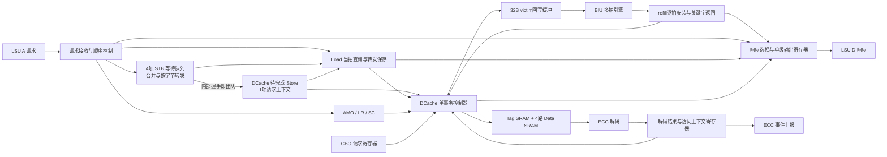

# stb_dcache 微架构设计与需求约定

版本：v1.0 配套架构稿，创建于2026-09-21，更新于2026-09-23。详细状态与时序见 [stb_dcache LLD](stb_dcache_lld.md)；首版RTL及验证状态见[RTL实现与验证状态](stb_dcache_rtl_status.md)。

本文依据当前目录中的需求 DOCX、stb_dcache.sv、dcache_def.sv、uncore_def.sv、类型定义、ECC 源码及本次讨论编写。用户已确认的行为为约束；本稿保留部分设计取舍说明，具体状态、时序及实现选择以配套LLD v1.0为基线。用户后续明确指令优先于两份文档。

## 1. 范围与已确认需求

| 项目 | 约定 |
| --- | --- |
| 模块与接口 | stb_dcache；保持当前 stb_dcache.sv 端口；flush_ex2 已删除 |
| 目标工艺 | TSMC 22ULL，2026-09-23进一步明确 |
| 频率签核要求 | clk_i为1GHz，对应时钟周期1.000ns；必须完成目标库、目标角及布局布线后的sign-off STA |
| 系统 | 32bit RISC-V，LSU → STB/DCache → BIU；本模块处理 cacheable 访问 |
| Cache | 16/32/64/128KiB，可配置；4 way；32B line；64bit 数据总线 |
| 策略 | Write-back、write-allocate；DCache 单个前台事务，miss 阻塞 DCache 后续访问 |
| STB | 默认4项；匹配任意有效entry的addr[31:3]合并，mask按位或；满且不能合并时ready=0 |
| STB drain | 与 DCache 的内部请求握手成功即释放队头；DCache 保存待完成 Store，完成前持续参与 Load 转发 |
| Store 应答 | 普通 Store 成功入队、合并或同拍合并至drain即具备应答条件，不等待 DCache 写完 |
| LSU 应答接收 | 用户确认 tl_slv_d_rdy_i 固定为 1；不设置响应 FIFO，仅保留单级 D 通道输出寄存器 |
| LSU 应答 error | tl_slv_d_ch_o.tl_d_error 固定为 1'b0；SC 成败仅由 tl_d_data 的 0/1 表示 |
| Miss 与接收 | DCache miss 期间 STB 有空间仍可接收普通 Store；仍受 Load/原子/CBO 顺序规则限制 |
| 普通请求选择 | DCache 空闲时普通 Load 优先于 STB drain；无强制轮转或 Store 等待超时提权，已开始事务不被抢占 |
| Load | 对齐64bit、mask=FF；Store转发全命中则下一拍返回，未命中/部分命中当拍直通DC；部分命中停新drain至Load完成，d_fire沿可同时接受下一请求 |
| 原子操作 | AMO/LR/SC 为32bit；接受前等待STB队列和DCache pending Store全部结束 |
| SRAM | 一块共享 Tag SRAM，四块 Data SRAM；均单端口同步读，读延迟一拍 |
| Tag 内容 | 四路 Tag + 四个 Dirty 整体 SECDED 编码；ECC 位在高位；Valid 在寄存器 |
| 数据路径 | SRAM 输出 → ECC 解码 → 寄存器，寄存前不做命中判断或数据运算；无 SRAM 输入到输出的组合直通 |
| BIU | 一笔 32B TileLink 多拍事务；每数据拍 8B |
| CBO | INVAL/CLEAN/FLUSH/ZERO/INVAL_ALL/CLEAN_ALL |
| ZERO miss | 分配行，必要时先回写脏 victim，再直接清零，不向主存 refill |
| Bus error | 只失效本次相关行，不向 LSU 报错；CBO 使用已有专用错误端口 |
| ECC 双错 | 检测、上报，继续当前访问；外部 Errctrl/Core 安全逻辑决定处置 |
| ECC 单错 | 使用纠正后数据，允许修复 SRAM |
| 错误地址 | Tag：index 高位补零；Data：{way[1:0], data_index} 高位补零至 18bit |
| busy | dc_fsm_busy=1 表示 DCache 非空闲 |
| refill优化 | Load关键beat下一周期返回；AMO关键beat下一周期返回/寄存结果、再下一沿写；普通beat下一沿安装；不安装后重读 |
| 晚到bus error | 关键beat之后的错误只使相关行保持invalid，不改变已确定响应；包含与LSU D握手同沿的后续beat错误。AMO miss使用1FF合并安装，hit使用10F/1F0 |
| 正常hit时序 | T1请求握手并同沿读SRAM；T2寄存ECC结果；T3普通Load返回、普通Store写入；AMO在T3返回并寄存结果、T4写入 |

本轮不实现非缓存旁路、跨行访问、多 miss 并发或一致性探测。输入路由应保证请求位于配置的 DCache 地址窗口；这是集成约束，不新增端口。

## 2. 参数与存储组织

默认使用现有宏：128KiB Cache、128MiB 地址窗口，基址 0x1000_0000。Cache 容量与可缓存地址窗口大小是不同概念。

```
SETS            = CACHE_BYTES / 32 / 4
TAG_INDEX_W     = log2(SETS)
DATA_INDEX_W    = TAG_INDEX_W + 2
TAG_W           = dcAddrWidth - 5 - TAG_INDEX_W
TAG_RAW_W       = 4 * (TAG_W + 1)
line_base       = {addr[31:5], 5'b0}
doubleword_base = {addr[31:3], 3'b0}
tag_index       = addr[5 +: TAG_INDEX_W]
beat_index      = addr[4:3]
data_index      = {tag_index, beat_index}
tag             = addr[dcAddrWidth-1 : 5+TAG_INDEX_W]
```

| Cache 容量 | Sets | Tag index 位数 | 每路 Data 深度 | Data index 位数 | Tag 位数（27bit 窗口地址） | Tag raw/ECC/总位数 |
| --- | ---: | ---: | ---: | ---: | ---: | --- |
| 16KiB | 128 | 7 | 512 | 9 | 15 | 64 / 8 / 72 |
| 32KiB | 256 | 8 | 1024 | 10 | 14 | 60 / 8 / 68 |
| 64KiB | 512 | 9 | 2048 | 11 | 13 | 56 / 7 / 63 |
| 128KiB | 1024 | 10 | 4096 | 12 | 12 | 52 / 7 / 59 |

Data SRAM 每项为 64bit 数据 + 8bit ECC，共 72bit。当前配置 ECC 开启、Parity 未开启；本轮验证上述四种容量的 ECC 配置，不把 ECC/Parity 同时开启作为已支持配置。

建议 Tag raw 打包为 `{dirty3,tag3,dirty2,tag2,dirty1,tag1,dirty0,tag0}`，整项编码；此布局尚无已有 RTL 约束，需在评审后固定。四路 Valid 独立存于 `valid[set][way]`。替换策略固定使用一个全局 16bit LFSR，不设置逐 set 的替换状态。详细规则见第 8.3 节。

Data wm[7:0]对应数据字节，wm[8]对应ECC。普通Store hit读改写完整码字，wm=1FF；miss直接合入目标refill beat。AMO hit业务写用10F/1F0，miss按用户最新确认将new32与refill原另一半组成完整64bit，以1FF直接安装，不追加半字写。ECC使用完整安装/修改值，不能使用补零的LSU响应值。AMO hit若读到单错先修复旧码字，再掩码写。Tag wm全1，CEB/WEB控制实际写入。

## 3. 总体架构

完整的请求/返回路径及SRAM流水图见 [整体架构图](stb_dcache_block_diagram.md)，其中标出了DC pending、同拍Store合并下发和部分命中Load的保存/合并路径。当前RTL的真实子模块层次与模块间信号见 [RTL实例级顶层框图](stb_dcache_rtl_hierarchy.md)。

带实际端口名、方向和默认配置位宽的版本见 [顶层端口架构图（SVG）](stb_dcache_ports.svg)。SRAM宏在stb_dcache模块边界外，模块通过tagram和dataram端口访问。



建议 RTL 内部分为请求/STB 前端、响应选择与输出寄存、DCache 控制与数据通路、BIU 引擎、ECC/SRAM 适配几个逻辑部分。是否拆成独立文件在 RTL 阶段决定，顶层端口不变。

建议寄存资源：4项STB等待队列、DCache内1项待完成Store上下文、单级D通道输出寄存器、1个Load/原子操作上下文、72bit Load转发结果保存、1bit stall_drain、1个CBO上下文、1个32B行缓冲、1个reservation、Valid阵列、全局16bit LFSR、ECC读结果寄存器。前台状态只需F_IDLE/F_WAIT，D响应等待由独立d_valid表示；旧Load d_fire沿可以清旧上下文并捕获新请求，因此不需要F_RESP或Load重排序队列。

待完成Store复用DC请求寄存器addr/data/mask；独立实现基本字段为105bit，另有控制状态，不包含在32B victim缓冲中。Store完成前这些字段不被Load、victim地址或refill覆盖。最多4项等待和1项执行；合并后entry可代表多条已应答请求。DC owner还保留refill响应去重标记，普通Load前台提前释放不清除旧owner状态。

### 3.1 VC 宏与行缓冲的区别

原始 dcache_def.sv 已定义 `VcEntry=1`、`EntryWidth=$clog2(VcEntry+1)`、`VcAddrWidth=dcTagWidth+dcTagIdxWidth`。这些宏来自输入资料，不是本稿新增；但现有需求文字没有定义 VC 的查找、命中、替换或独立驻留行为，仅凭宏名不能确定其功能。

本稿没有设计可独立命中的 Victim Cache，也没有把 `VcEntry` 自动解释为这种缓存的容量。图中的“32B 行缓冲”是本稿提出的事务暂存资源，具体为：

| 项目 | 本稿建议 |
| --- | --- |
| 数量与容量 | 1 个 cache line，共 32B=256bit 数据，组织为 4×64bit 寄存器 |
| 用途 | 暂存脏victim数据供BIU回写；refill绕过整行缓冲，逐beat安装并直接返回关键字 |
| 地址与控制 | 行基址、目标 set/way、拍计数、数据有效状态、事务错误状态保存在 DCache/BIU 上下文中；这些控制位不包含在 256bit 数据容量中 |
| 生命周期 | 仅当前事务持有；完成后释放，不保留为额外可查询缓存行 |
| 并发 | 回写四个A拍和应答均完成后释放；BIU先回写再refill，refill使用单拍写命令流水 |
| 查找关系 | LSU 和 STB 不单独查询这个缓冲，不存在 VC hit 路径 |
| 与现有宏关系 | VcEntry 系列宏是旧版遗留，不作为新设计约束；RTL 阶段确认无引用后删除，行缓冲大小由 dCachelineSize/MaxBeat 推导 |

用户已授权按新需求重新评估旧 VC 设计，不必沿用旧结构。本轮架构选择：不设置独立 Victim Cache，保留 1 个 32B 事务行缓冲。该决定不代表其他架构评审项已全部通过。

### 3.2 VC / 行缓冲必要性评审

本评审基于当前结构和需求作设计取舍，尚无工作负载 miss 统计或综合结果，不宣称获得了量化的性能/面积最优解。

| 方案 | 能解决的问题 | 增量与限制 | 本轮选择 |
| --- | --- | --- | --- |
| 独立 1 项 Victim Cache | 保留最近替换行；若后续重访，可减少部分冲突 miss 的下级访问 | 需要地址命中、交换/替换、Dirty/Valid 管理；CBO 单行和全表操作还须覆盖 VC；收益依赖访问模式 | 不采用；当前无冲突 miss 数据证明收益，4-way Cache 加此结构也不解决所有 miss |
| 独立写回队列，加独立 refill 存储 | 为回写与 refill 重叠提供存储条件 | 还需要 BIU 并发 source、响应追踪和错误依赖处理；仅增加缓冲不能自动获得重叠收益 | 不采用；当前选择单事务、回写应答后再 refill |
| 流式refill，逐beat写命令寄存 | Load关键数据直接返回，收数与安装重叠，末写后发布 | 普通beat检查BIU输入至ECC路径；AMO关键beat多一拍并反压一次；全行成功前保持invalid | 已采用 |
| 保留32B victim缓冲，refill直接流式安装 | 回写仍可收齐后连续发送，统一服务eviction/CLEAN/FLUSH/CLEAN_ALL | 256bit仅承担victim暂存，不再让refill等待整行缓存后重读 | 采用；取消原先refill收齐后安装的流程 |

完整行缓冲不是功能上必需的硬约束：流式方案同样可以正确实现；它也不直接提高 Cache 命中率，不能被当成 VC 性能优化。

32B恰能容纳一次victim回写的四个64bit拍。收集完成后BIU ready连续有效即可连续发送。refill不使用这256bit阵列等待整行，而是D握手时形成编码写命令、下一沿写SRAM；关键beat并行进入响应路径。数据写入可早于整行成功，但Valid仅在末写与Tag提交时发布。

256bit缓冲生命周期为`FREE → VICTIM_CAPTURE → WB_SEND/WAIT → FREE`。干净miss不占用它；ZERO使用零数据源复用安装流水。提前到达的回写应答不能在四个A拍发送完成前释放/覆盖缓冲。

后续若性能统计显示冲突 miss 显著，重新评估 VC；若瓶颈为脏替换等待 BIU，则评估独立写回队列和协议并发；若面积优先，则评估流式暂存。三类优化分别解决不同问题，不因旧宏存在而预先加入。

## 4. STB 接收、合并和生命周期

### 4.1 条目

每项包含：有效位、32bit 双字对齐地址、64bit data、8bit mask。队列由 head/tail/count 管理；head 指向最早分配且尚未交给 DCache 的条目，tail 指向下一可分配位置。默认 STB_DEPTH=4，只计算等待条目，不包含 DCache 内1项待完成 Store；参数化指针显式处理回绕和深度1。已交给 DCache 的 Store 不占 STB 条目，不设置 locked 或 drain_hold。

普通 Store 比较所有有效等待 entry 的 addr[31:3]，同址即可合并，不限定队尾；同一双字最多保留一个等待 entry。该规则适用于本模块的 cacheable 普通 Store；SC 等特殊请求先单独译码，不进入普通 Store 合并。新 Store 不修改 DCache 已接受的 pending；若同址 entry 正在本拍被接受为 drain，则按4.3节直接合并下发。

```
merged_mask    = old_mask | new_mask
merged_data[b] = new_mask[b] ? new_data[b] : old_data[b]
```

每条被接收的 Store 都单独生成一次响应；合并只减少缓存写入次数，不合并 LSU 应答。

### 4.2 生命周期与提前应答

1. A 通道握手，保证 STB 分配/合并或同拍合并至drain成功且当前顺序规则允许接收，无需分配响应 FIFO 槽位。
2. 在握手沿把本条请求的 source/size 和 AccessAck 写入 D 输出寄存器、置响应有效；随后的响应周期对 LSU 可见，在下一个上升沿被接收。tl_slv_d_rdy_i 恒为 1，连续 Store 可在每拍消费前一响应并替换为下一响应。
3. 内部 drain_fire 时，DCache 原子地保存最终队头地址/data/mask（包括本拍同址 Store 合并）并置 pending_store_valid；同沿 STB 清原队头有效位、推进 head，立即释放 entry。
4. DCache 持有并处理这条 Store，期间内容不允许被新请求覆盖。完成 Data/必要的 Tag 写入及相关收尾，或完成 bus-error 协议收尾后，才清 `pending_store_valid`。这个完成事件不再弹出 STB，也不生成第二次 LSU 响应。
5. Load 同时查询 STB 等待条目及 DCache 待完成 Store；每字节以较新的 STB 内容优先。Store 的转发责任从队列转到 DCache，不能出现中间不可见的一拍。

这里的接收事件属于STB到DC的内部选择。DC空闲或普通Load hit可在本沿移交、队列非空、无stall（或所属Load本沿d_fire解除stall）且没有更高优先请求获选时产生drain_fire；同一沿直接让SRAM采样读。普通Load hit移交仅在无修复/维护/写冲突时开放。refill最后写/Tag提交沿占用单端口SRAM，不接下一项；提交后下一周期再作为新请求T1。

建议内部信号语义如下，仅为逻辑边界，不新增顶层端口：

| 信号/状态 | 含义 |
| --- | --- |
| drain_candidate / drain_payload | 由当前head及当拍输入形成的组合候选地址/data/mask；没有跨拍冻结义务 |
| stall_drain | 部分命中Load接受后置位，至其D响应被接收清零；同沿接受新部分命中Load时重新置位优先 |
| drain_fire | 候选实际获选且DCache能接收，采样沿唯一触发STB出队及DC保存 |
| pending_store_valid | DCache 已接管、尚未处理完成的普通 Store |
| store_done | 当前 Store 正常完成或按约定完成错误收尾，清 pending 状态，不再操作 STB 指针 |

入队应答视为该普通 Store 已提交，后续不能被流水线取消。本顶层没有取消端口。

前端允许普通 Store 时，ready=can_merge || !full。STB 满但任意有效项可合并时 ready=1；满且不能合并时 ready=0。没有响应 FIFO 反压。满判断使用沿前状态，不通过同拍出队旁路接收未命中的新条目，避免 ready 依赖 drain_fire。

因此队满时若本拍发生 drain，释放的空间最迟下一拍可用于接收新条目；不是继续等 Store 执行完成。4+1 结构增加一个事务容纳位置，不能消除长 miss 下持续输入最终导致的反压。

### 4.3 同拍合并与出队

同址输入普通 Store 与 head drain 在同一沿均被接受时，按输入mask选择新字节、两mask按位或，直接保存到DC pending并释放head；不写回旧entry，不另行入队。mask=FF下发PutFullData，否则PutPartialData，内部请求为双字对齐地址、size=3、param=0。新Store独立应答一次；已应答的旧Store不重复应答。

没有drain_fire时，同址Store只合并等待entry。输入命中非head时可更新该项并同时弹出head；输入未命中且非满时可分配tail并同时弹出head。统一计算 count_next=count+alloc_fire-drain_fire；合并不增加count、不推进tail。空队列先入队，最早下一拍drain。

内部只在实际接收沿采样候选，不采用“呈现后保持payload直到ready”的接口，不需要冻结head。外部LSU/BIU的valid/ready保持规则不变。Load完成前阻止后续LSU请求，但d_fire完成沿即为新接收窗口，无须空等一个F_IDLE周期；AMO/LR/SC/CBO必须等待队列和pending全部结束。

## 5. Load 转发与请求顺序

### 5.1 按字节查找

Load 当拍并行比较所有有效等待 entry 和 pending 的双字地址。同一双字最多一个等待 entry，其数据比同址pending更新：每字节优先取等待entry有效字节，再取pending字节；两处均未覆盖才取DCache结果。覆盖mask为两源mask按位或。

请求当拍组合形成forward_mask/data及全覆盖判断。全覆盖时A握手沿直接装载D输出，下一拍返回；未全覆盖时当拍直通DC，LSU ready取决于dc_can_accept及仲裁，LSU与DC同沿接受并保存合并后的72bit转发结果。dc_can_accept包含当前DC空闲，以及普通Load hit无修复/写冲突时的T3同沿移交。不设置接收后的查询流水或前端待派发队列；DC不接受时LSU也不握手，上游保持请求，下一拍重新查询。

Store转发全命中Load与drain同拍接受时，D输出捕获沿前STB/pending的组合转发结果，因此仍能看到即将出队的Store；与pending完成同拍时也使用沿前内容。转发未全命中Load接受时保存的是合并后的data64+mask8，保留至该Load完成，不在返回时重新读取可能已变化的源entry。全命中判定为`(forward_mask & load_mask)==load_mask`，地址相同但mask未覆盖全部请求字节只是部分命中。

| 类型 | 行为 |
| --- | --- |
| 完全覆盖 | A接受后的下一拍返回，不申请DC读取，可与drain并行 |
| 部分覆盖 | 当拍直通DC，实际接受时保存转发结果并停新drain；返回时覆盖，D被接收后解除stall |
| 完全未覆盖 | 当拍直通DC，是否接受取决于DC空闲及仲裁；直接使用返回双字 |

例如：STB 仅覆盖 mask=0F，普通 Load mask=FF，则返回 `{dcache_data[63:32], forward_data[31:0]}`。

如果 pending Store 覆盖高四字节 F0，STB 中较新条目覆盖低四字节 0F，两者可以共同满足一个 mask=FF 的 Load，无需等待 Store miss 完成。两处覆盖同一字节时必须选 STB 内较新的值。

### 5.2 首版顺序规则（建议）

- A 请求按握手顺序接受；D 响应按接受顺序送出。
- Load/原子请求接受时在单项请求上下文记录 source/size 等信息；结果完成后写入 D 输出寄存器，不预留响应槽位。上下文仍用于跨 miss 保存请求及转发快照，与 LSU 是否反压无关。
- 普通 Store 连续接收，每条请求下一响应周期返回一次应答，source/size 按原请求返回；不通过 FIFO 排队。
- 接受一个Load后，在其D响应被LSU接收前暂停接受后续A；d_fire完成沿允许同时接受下一请求。旧上下文清除、D valid清除及stall清除均低于同沿新上下文/新响应/新stall装载的优先级。
- Load miss关键beat可提前完成D，剩余refill仍占用DC owner；此时可接收普通Store或Store转发全命中Load，需要DC的新Load继续等待。AMO提前响应后仍阻止后续LSU请求至原子事务完整收尾。
- 普通Load hit的T3允许同沿接受下一DC请求并采样SRAM读，前提是旧请求无修复/维护/在途写；旧响应使用T2寄存结果，新上下文捕获优先于旧清除。连续DC hit Load可每两周期接受一笔。
- 原子请求分别保存响应已消费和DC工作已完成；把本沿事件计入后，两者均满足即可同沿接受下一请求，不空等F_IDLE。新请求仍检查所需资源，AMO提前响应但写入/refill未结束时不开放。
- 部分命中Load接受后stall_drain保持至D响应被接收，期间停止新drain；Store转发全命中Load可与drain并行。已接受Load使用保存的转发值，不重新读活动entry。
- 当 DCache 被更早 Store miss 占用，两处转发源合计完全覆盖的 Load 仍可完成；部分覆盖/未覆盖 Load 等待 DCache 空闲。
- DCache 空闲时，普通 Load 严格优先于尚未握手接收的 STB Store。Store 已向 LSU 应答，Load 仍在等待返回数据，因此先服务 Load；正确性由已保存的较早 Store 转发快照保证。
- 无需DCache读取的Store转发全命中Load不占SRAM，可与STB drain并行。没有需要占用DCache的普通Load时才选择队头Store；不在每个Load后强制插入一次Store，也不采用Store等待计数器提权。

### 5.3 空闲请求选择与事务独占

这里只选择下一个 DCache 事务，不设置 Load/Store/CBO/ECC 四方 SRAM 抢占仲裁器。一个请求被 DCache 接收后，FSM 独占其需要的 SRAM 操作，直到当前事务及附属 ECC 修复完成。

| 条件 | 动作 |
| --- | --- |
| 普通Load hit在T3完成D，且无待修复/维护/在途写 | 旧请求使用寄存结果返回；SRAM可同沿采样下一请求，按正常Load优先于drain规则选择，主FSM直接到新请求LOOKUP_ECC |
| DCache 已有事务（含 Store miss、回写/refill、CBO、事务内修复） | 继续当前事务，不因新Load到来中断；新Load若Store转发全命中则可由前端完成 |
| DCache 空闲，前端允许接受且本拍普通Load未全覆盖 | 当拍选择Load并与LSU同沿接受，drain_fire=0 |
| 部分命中Load已接受且尚未完成D响应 | stall_drain=1，不选择新drain |
| DCache 空闲，Load 已确定完全由转发满足 | Load 返回与 drain 可并行，是否 drain 仍取决于队列及其他顺序条件 |
| DCache 空闲，无需要 DCache 的普通 Load，STB 有待 drain 条目 | 握手接收队头 Store；即使其后紧接着来了 Load，也不撤销已接受的 Store |
| refill最后Data/Tag正在本沿提交 | 本沿不接需要读SRAM的新请求；提交后进入IDLE，下一周期握手并同沿读SRAM |

未获选的drain只是组合候选，不冻结payload或head；选择Load时本拍不接收drain。上表的新Load须满足前端顺序条件；等待排空的原子请求不能阻止旧Store排空。CBO在`stb_drained_out`拉高前不由上层发送，因此不参与这段内部仲裁。

AMO/LR/SC在模块内执行既定的先排空规则，等待期间允许更早的Store drain。CBO不同：本模块只负责输出准确的`stb_drained_out`，上层Core等待该信号为1且前一笔blocking请求完成后才发送CBO，因此模块内没有CBO等待Store排空的阶段。

除已明确的普通Load hit同沿移交外，执行中事务仍独占DC。该选择不保证连续有待服务Load时Store在固定拍数内得到执行；drain利用无此类Load的空档。验证应要求在无Load/原子/CBO占用且下游最终能完成的条件下，STB持续取得进展，而不是强制规定持续Load压力下的轮转公平性。

这是面向高频、控制复杂度可控的首版方案。高频不等于每拍接收一条 Load；多 Load 流水需要额外顺序队列，暂不承诺。

## 6. 响应和状态输出

| LSU 请求 | D opcode | D data |
| --- | --- | --- |
| 普通 Store | AccessAck=0 | 0 |
| 普通 Load / LR | AccessAckData=1 | 读取值 |
| AMO | AccessAckData=1 | 修改前的值 |
| SC | AccessAckData=1 | 整个 64bit 数值为成功 0、失败 1 |

D param=0，source/size 回传原请求。tl_slv_d_ch_o.tl_d_error 无条件固定为 1'b0，SC 成功/失败通过 tl_d_data=64'd0/64'd1 表示，与 error 字段无关。SC 是项目扩展，不能机械套用普通 PutPartial 的无数据应答规则。

### 6.1 单级响应输出及冲突约束

LSU的tl_slv_d_rdy_i恒1。Store Ack、Store转发全命中和普通Load refill关键数据使用单级D寄存路径；DCache hit结果从T2 ECC结果寄存器经选择逻辑在T3完成D握手，AMO miss旧值从critical_old64在捕获后的下一沿直接握手，不再经过一级最终D寄存器。响应选择器的寄存/直接两路必须互斥。没有响应FIFO；同沿旧响应消费和新响应装载允许重叠，新装载在next-state中优先。

每拍最多一个新响应写入输出寄存器，依靠当前请求顺序规则保证，而不是把 ready=1 当作可同时发送多个响应：

- 纯 Store 流中，A 每拍最多接收一个请求，因而每拍最多产生一个 AccessAck。上一响应被接收的同一沿可装载下一响应；连续有效不要求中间插空拍。
- 接受Load前的Store响应最多只剩输出寄存器中那一个，可在Load接受沿先被消费；Store转发全命中Load在同沿装入下一响应，随后一个周期才对LSU有效，保持响应顺序。未全命中Load的结果更晚到达。
- Load响应被消费前不接受后续A；普通Load d_fire沿可以同时接受新Store或下一Load。若新请求立即产生D响应，沿上消费旧payload并装载新payload，下一周期输出，保持请求顺序。AMO仅d_fire不足以开放窗口，还须owner收尾。
- 后台 pending Store 完成不再生成 LSU 应答；CBO 使用独立 cbo_ack_o，也不占用 D 输出。

原子完成记录保存在前台，不随DC owner提前释放而清除。AMO可先消费D、后完成工作；SC可先完成工作、后消费D；SC reservation失败从接受时即视为工作结束。两项完成条件计入本沿事件后满足即可释放并接新请求，旧完成记录清除低于新原子初始化。

无新响应时下一周期清输出valid；复位清valid。验证应检查响应生成源互斥、每个A请求恰好一次D响应，以及source/size/顺序正确。tl_slv_d_rdy_i=1是集成约束；BIU反压仍须保持payload。内部drain按当拍选择/采样定义，未被接受时条目仍可合并。

### 6.2 返回数据与状态输出

32bit AMO/LR返回原目标lane、另一lane清零；SC返回整个64bit的0/1。AMO hit用10F/1F0修改目标lane；miss直接按1FF安装修改后完整双字，其中另一半取refill原值。AMO旧值响应与安装数据分开，响应补零不影响写数据。

`stb_drained_out = (stb_count == 0) && !pending_store_valid`。内部尚未握手的 drain 请求仍属于队列项；已握手请求属于 pending，二者都被该条件覆盖。末项移交时 count 清零与 pending 置位发生在同一时钟沿，drained 不能产生虚假的排空脉冲。该信号表示 Store 排空，不代表整个模块完全空闲；CBO/原子仍额外检查 DCache 和较早的 D 输出响应已完成。

`dc_fsm_busy` 建议覆盖 DCache 当前事务、BIU 事务、SRAM 修复及 CBO；不因单独的 Store 提前应答输出置忙。这是 DCache busy，STB 状态由 drained 单独体现。

## 7. SRAM 时序与高频边界

目标工艺为TSMC 22ULL，频率sign-off要求为1GHz（clk_i周期1.000ns）。该周期不等于可全部分配给组合逻辑的延迟预算；具体路径需计入寄存器时序、时钟不确定性、时钟偏斜、布线，以及相关SRAM或接口延迟。标准单元/SRAM库、工作电压、PVT/RC角、variation方法和接口输入输出延迟由项目sign-off约束确定，不在本稿虚构数值。

建议查找时同时读 Tag 和四路 Data 的目标双字。下一阶段从已寄存的数据选择命中 way，不把 Tag 比较与 SRAM 解码串联。

| 时点 | 行为 |
| --- | --- |
| T1沿前 | 当拍获选的drain/A请求组合驱动SRAM地址和读使能；未握手不使能 |
| T1 | 请求握手并同沿让Tag和四路Data SRAM采样读 |
| T1→T2 | SRAM输出只送ECC解码 |
| T2 | 寄存纠正数据、错误标志及请求上下文 |
| T2→T3 | Tag比较/way选择；Load选择和转发覆盖；Store合并/ECC；AMO旧值选择、ALU/ECC |
| T3 | 普通Load D握手；普通Store写Data/必要Tag；AMO D握手并寄存最终写命令 |
| T4 | AMO Data/必要Tag实际写入，原子事务完成 |

普通Load hit的T3若无修复/维护/在途写，可同时成为下一DC请求的T1。旧D只使用T2寄存数据，SRAM同沿采样新地址；新上下文覆盖旧清除，主FSM直接进入LOOKUP_ECC。该移交增加Tag命中/完成判断到新ready及SRAM读使能路径，必须纳入1GHz STA。Store/AMO/refill实际写沿不能同时读同一宏。

普通Store不经过额外raw/写命令寄存；AMO按最新要求多拆一拍。refill非关键beat在mst D握手沿寄存编码写命令、下一沿写；AMO关键beat先保存旧值，下一周期响应并寄存AMO写命令，再下一沿写入。

Tag Dirty 更新也必须从已寄存的整项 Tag raw 修改、重新编码、整项写回；不能构成 tagram_rdata_i → tagram_wdata_o 的组合通路。

逐周期基线见[LLD第6节](stb_dcache_lld.md)。T1握手与同步SRAM采样同沿，T2寄存ECC结果，T3普通Load/Store完成；AMO多一拍到T4写入。后续以TSMC 22ULL目标库和1.000ns约束完成sign-off验证，不能为方便控制隐式增加读命令或结果状态。

## 8. DCache 命中、替换与 miss

### 8.1 命中

- Load：选取命中 way 经 ECC 解码并寄存的 64bit 数据，按已保存的两处 Store 转发掩码逐字节合并，再返回 LSU。
- Store：mask=FF 时直接使用写数据；部分 mask 与读出的旧数据合并，写 Data，必要时更新 Dirty=1。
- AMO：T3返回旧目标32bit且另一半补0，同时寄存new64/ECC和10F/1F0写命令；T4写目标lane并置Dirty，原另一半不写。T4前保持原子互斥。
- 命中不更新替换状态；全局 LFSR 只在成功安装新行时推进。

选择 victim 时先检查四路 Valid：存在无效路就选择编号最低的无效路；四路都有效时，使用全局 16bit LFSR 的低两位选择 way0～way3，并立即锁存 victim way。LFSR 使用非零复位种子，只在新行成功安装后推进；总线错误、安装失败及命中访问均不推进。

### 8.2 Miss

```
LOOKUP_EVAL（T2→T3比较Tag，同时预选victim）
  clean/invalid victim → 当周期呈现Get，T3可握手 → REFILL
  dirty victim → T3首读 → VICTIM_READ → WB_WAIT → REFILL
REFILL：每拍接收/编码/安装；关键beat直接响应
      → 最后Data与Tag提交、置Valid → IDLE，随后周期接下一请求
```

32B行缓冲只用于收集victim并发送writeback，victim每拍均经过ECC寄存。refill不经整行缓冲，使用一个逐拍写命令寄存器；输入空拍清写valid，上一有效写仍可提交，不重写旧beat。

取消独立MISS_SELECT：Valid/LFSR候选和候选Dirty与Tag比较并行，clean/invalid miss在LOOKUP_EVAL当周期经BIU启动直通驱动Get A；ready=1则T3握手，反压时保存上下文并保持请求。首个D最早在首个A握手后的下一拍接收，不支持首A与首D同拍握手。安装Tag准备与后续收数重叠。

victim复用本次lookup已读且ECC寄存的选中way双字，只连续补读其余3拍；CLEAN_ALL等无可复用Data时连续读4拍。ECC结果直接寄存进行缓冲，最后一项寄存后即可呈现首Put，不经过WB_START。复用要求上下文和set/way/beat相符且数据未被修改，错误信息一并保留；单错先收完在途读再修复，完成必要修复才发Put。回写完成沿W0直接转REFILL，随后周期呈现Get，最早W1握手；旧Put应答只归旧事务。

CBO决策并入LOOKUP_EVAL，完成/失效/扫描游标推进作为当拍事件，不为CBO_ACTION、FINISH、BUS_FAIL或SCAN_NEXT另占周期。保留实际Tag写、ECC修复和总线等待。状态表及无反压时间线见LLD 5.1–5.3、6.4。

critical_beat=req_addr[4:3]。Load关键beat接受后下一周期返回；AMO关键beat先保存，下一周期返回旧值并寄存AMO结果，随后一沿写入。AMO关键beat后对mst D反压一个周期，避免与下一beat争用单端口Data SRAM。无错时最后一个在途Data写与Tag写/Valid发布同沿完成；该提交沿不接下一DC请求，随后周期再以T1方式握手和读SRAM。

victim 若为脏行，先完成正常回写；在覆盖目标 way 的 SRAM 内容之前清该 way 的旧 Valid。干净 victim 可直接清旧 Valid。安装完成后发布新 Valid。

Store/SC直接修改目标refill beat并完整安装。AMO miss也以1FF安装完整修改值，但关键beat额外经过“保存old→运算/ECC寄存→写入”两拍。Load的STB覆盖只影响响应。即使Store mask=FF也须refill其他beat；ZERO不发Get。LR/SC保持全行提交后返回/建锁或报告成功。

关键beat或此前error时Load/AMO返回0且不叠加转发；关键beat之后的beat错误只保持本行invalid，不改变已确定结果、不重复响应，即使该错误与LSU D握手同沿。关键beat握手时保存含本拍错误的critical_err；后续整笔err_seen继续累计以控制安装和发布，但不再影响该响应。response_issued随原DC owner保留至整笔收尾，只控制响应去重；旧error不得访问已复用的前台上下文。AMO早响应后仍保持原子互斥，晚到错误可能使已返回旧值的修改不发布，这是用户已确认的语义。完整周期与状态见LLD 6.3及[refill修订记录](stb_dcache_refill_revision.md)。

### 8.3 替换策略

替换策略固定为全局 16bit LFSR 伪随机选择，不提供其他编译配置或运行时切换。所有 set 共用这一个 LFSR，因此替换状态只有 16bit。128KiB 配置的 Valid 为 4096bit，Valid 加替换状态共 4112bit。

LFSR 不参与命中数据路径，也不在 hit 时更新。全有效 miss 时只需读取当前低两位并锁存 victim，避免引入逐 set 替换状态的读写、译码和时钟活动。伪随机策略不保证每种程序都获得最佳命中率；这是本设计为降低寄存器面积和控制复杂度作出的固定取舍。

## 9. BIU 事务约定

建议只保留一个 BIU outstanding，writeback 和 refill 严格串行。master source 建议固定使用 LSU DC master 编码、outstanding id=0，即当前 4bit source=4'b0010；最终与 BIU 路由联调。

| 操作 | A 通道 | D 通道 |
| --- | --- | --- |
| refill | 单拍 Get，size=5，addr 为 32B 行基址，mask=FF | 四拍 AccessAckData，每拍 64bit，size=5 |
| writeback | 四拍 PutFullData，size=5，mask=FF | 一拍 AccessAck，size=5 |

writeback 四拍的 address/source/size/opcode/param 保持不变，只有 data 按行内 0、8、16、24 字节顺序变化，不能把它发成四笔递增地址的独立请求。计数仅在 valid && ready 时推进，所有反压期间 payload 保持稳定。

BIU 引擎在发送 A 的阶段也须具备接收匹配 D 的能力，不能假定 D 必须晚一拍到达。writeback 完成必须同时满足四个 A 数据拍已接受、D 应答已接收；提前接收到的应答和错误状态要寄存。

BIU在B_IDLE接到start_get/put时当周期直接呈现A，不增加“先锁存启动、下一周期才发A”的等待。A valid不依赖ready；启动沿只处理A握手，已接受的首A不重发。首个D最早在该A握手后的下一拍接收；bus_done为事件。主REFILL可在BIU回B_IDLE后继续等待末个SRAM写提交，不能据BIU空闲提前释放DC。

refill 任一拍 error 都置整条事务 sticky error，但仍收完规定四拍，释放协议事务。BIU 需在出错时也完成预期应答拍数；本模块没有超时/取消端口。协议不合法的 opcode/source/size 属于验证断言检查，不与普通 bus error 混为一谈。

上述多拍规则参考 [Chipyard TileLink Edge Object Methods](https://chipyard.readthedocs.io/en/latest/tilelink-diplomacy-reference/edgefunctions/) 和 [Rocket Chip TileLink Monitor](https://github.com/chipsalliance/rocket-chip/blob/master/src/main/scala/tilelink/Monitor.scala)。项目 LR/SC、简化 error 字段和“不向 LSU 报错”策略以本项目约定为准。

## 10. AMO、LR/SC

AMO/LR/SC仅在STB等待队列为空、pending_store_valid=0、dc_can_accept、较早响应已消费或本沿消费时接受；执行期间阻塞新的LSU A，满足原子释放条件的沿可同时接受下一请求。AMO opcode=2/3，size=2，支持文档列出的MIN/MAX/MINU/MAXU/ADD/XOR/OR/AND/SWAP；有符号比较限定32bit，ADD按32bit截断。

reservation 建议记录 `{valid, doubleword_base, mask}`。LR 的 mask 为 0F 或 F0；成功 LR 完成时更新 reservation。SC 必须 doubleword_base 相同且 mask 完全相同，并且 reservation 有效；失败不访问 SRAM/BIU，返回 1。每次 SC 尝试均清 reservation。

| 事件 | Reservation 更新 |
| --- | --- |
| 普通 Load | 保持 |
| 接收普通 Store | 同双字且 mask 重叠则失效；采用接收时失效，不等后台写完 |
| AMO 实际执行 | 同双字且 mask 重叠则失效 |
| 新 LR 完成 | 替换旧 reservation |
| 任意 SC | 失效 |
| 接收任意 CBO | 无条件失效 |
| lr_invalid | 无条件失效，优先于同拍 LR 建立 |
| 正常 victim writeback / refill | 保持 |

SC 成功条件在进入原子写操作前采样；同拍 lr_invalid 优先导致失败。成功 SC 的逻辑执行点为该采样点，之后的 lr_invalid 不撤销已经开始的原子写操作。原子序列期间 DCache 不服务其他请求。

## 11. CBO

CBO req保持至ack，上游保持type/address。本模块输出`stb_drained_out=(stb_count==0)&&!pending_store_valid`；上层Core只有在该信号为1且前一笔blocking请求完成后才发送CBO。因此合法CBO到达时不存在旧Store、旧Load或旧原子事务，模块不提供“先锁存CBO、再等待排空”的能力。接受沿保存type/address并清reservation；CBO不使用普通Load hit的T3移交旁路。

合法CBO被接受后直接执行，不设置`C_DRAIN`。命令只执行一次，ack为完成脉冲；req未撤销前不重复接受，C_WAIT_LOW的旧高req不继续阻塞LSU。CBO与新的LSU A同时出现时CBO优先。无ready端口时以req保持及ack完成构成协议，不依赖单拍请求。

| 指令 | Hit 行为 | Miss 行为 |
| --- | --- | --- |
| INVAL | 清 Valid，允许丢弃脏内容，符合已给定语义 | ack |
| CLEAN | Dirty 则回写，成功后清 Dirty，保留 Valid | ack |
| FLUSH | Dirty 则回写，成功后清 Dirty/Valid；干净行直接失效 | ack |
| ZERO | 整行四拍写零，Dirty=1，保留/置 Valid | 替换，必要时回写 victim，再安装全零脏行 |
| INVAL_ALL | 一次清所有 Valid，不访问 SRAM | 不适用 |
| CLEAN_ALL | 按 set/way 扫描，只回写 valid 且 dirty 行，成功清 Dirty、保留 Valid | 不适用 |

单行操作只有在该 set 四路 Valid 全为 0 时才能完全跳过 Tag 读；只知道“某一路无效”不足以判定地址 miss。ZERO 仍须建立新行。

CBO 的 bus/double-ECC 错误在命令内 sticky（记录是否发生过，不累计次数），和最终 cbo_ack 同拍输出一个周期。cbo_bus_err_o 表示该 CBO 的回写收到 BIU error；cbo_ecc_err_o 表示该 CBO 检测到有效 Tag/Data ECC 双错，单错不置此位。新命令开始时清两个累计位。CLEAN_ALL 遇 bus error 时失效出错行并继续扫描，其余行不受影响。CBO 双错按用户要求继续；常规 Tag/Data ECC 事件在检测阶段照常上报，不推迟到 ack。

## 12. ECC、未初始化 SRAM 与修复

ECC 使用现有 ecc_codec / prim_secded_pkg。解码数据、错误位及对应访问地址在同一寄存边界保存；不能用后续请求地址给前一个 SRAM 错误打标签。

Tag 整个 set 无有效 way 时，忽略 SRAM 旧内容和 ECC 状态，以全零 raw 为初始化基础。set 已有有效 way 时必须解码整项，因为四路共用 ECC；写回时把无效 way 的 Tag/Dirty 归零，再更新目标 way，保持完整码字有效。

普通查找虽然物理上读取四路Data，但只使用和上报命中way的数据错误；miss时无关Data不报错。选中valid dirty victim后，复用lookup双字时检查其已寄存错误并归属victim收集，其余beat在补读后检查；未选中way、无效行、无效流水拍不产生ECC事件。

建议单错修复为当前事务内的小步骤：

- Tag 单错：用寄存的纠正后 raw 重编码整项；若事务本来会更新 Tag，则合并为一次最终写。
- Data单错：用寄存的纠正后双字重编码；普通Store hit固定使用1FF完整业务写合并修复，在T3一次写入最终数据，不额外SCRUB，单错事件仍只上报一次。AMO hit必须先修复旧完整码字，再按目标lane掩码写入新值及ECC，避免未使能半字的单错残留。
- 在释放当前 DCache 事务前完成修复，不使用会与较新 Store 竞争的延迟后台 scrub 队列。
- 双错不安排“纠正修复”；正常 Store、替换、CBO 写入仍按当前事务继续。

check_en_i 仅控制常规 tag_err/data_err 上报，不控制纠错数据选择或事务执行。建议 CBO 专用错误输出不受该开关屏蔽。tag/data err_vld 为事件脉冲，type=01 单错、10 双错，若同时置位则双错优先；无事件时 type/address 清零。每拍最多一个 Tag 事件和一个选中 Data 事件。

双错后的数据和 Tag 可能不正确；继续执行并不保证访存结果正确。特别是 Tag 双错后命中和地址重建只能基于解码器提供的 raw 结果继续，外部安全系统必须承担该已确认策略的后果。本模块不自行暂停等待外部恢复。

## 13. Bus error 收尾

用户已确认“不向LSU报错、只失效相关行”。Load/AMO以关键beat握手为错误分界：该beat或此前error则返回0；之后beat报错不改变既定响应，包括与LSU D消费同沿的后续beat错误。LR整笔失败返回0且不建锁，SC失败返回1。所有情况下tl_d_error恒0。

| 场景 | 行处理 | 请求收尾 |
| --- | --- | --- |
| refill错误在关键beat之前/当拍出现 | 目标way保持invalid，已写部分Data不发布，停止后续有效安装写 | Load/AMO关键beat响应为0，不覆盖转发；LR整笔收尾返回0且不建锁；协议仍收四拍 |
| refill错误在关键beat之后的beat出现，含与LSU D同沿 | 同上；不更新LFSR | 保持关键beat时确定的结果，原D不改零、不撤回、不补发；收齐后释放原owner，不覆盖较新前台响应 |
| victim writeback错误 | 失效victim，不继续refill/ZERO | 尚未响应的Load/LR/AMO返回0；已应答普通Store只清pending，不再弹STB |
| Store miss refill 错误 | 失效目标 way | 协议收尾后清 pending 状态；其 STB entry 已在接收握手时释放，不重复出队、不重复应答、不自动重试 |
| AMO miss/回写错误 | 相关行不发布；流式安装中已写入的修改随invalid不可见 | miss按关键beat错误快照响应，之前的victim回写失败返回0；tl_d_error恒0，收尾前不释放原子互斥 |
| SC miss/回写错误 | 相关行不发布，部分安装Data保持不可见 | 返回失败64'd1，tl_d_error恒0，reservation清除 |
| CBO 回写错误 | 失效出错行 | 单行操作 ack+bus_err；CLEAN_ALL 继续，最终 ack+sticky bus_err |

失效相关行表示清对应 set/way 的 Valid，不清全 Cache，不清其他行。writeback 失败失效的是旧 victim；refill 失败不发布新 line。这里没有新增普通 bus_err 端口。

不自动重试，完成规定协议应答后释放当前事务；Store转发全命中Load未发起DCache访问，不继承其他后台Store事务的bus error。不能以后台Store的错误覆盖已经独立返回的Load响应。

## 14. 复位、时钟与编译结构

建议异步低有效复位寄存状态：Valid、STB、stall_drain、pending_store_valid、D 输出有效位、reservation、上下文有效位、FSM、事件输出；不复位 SRAM。复位后 CEB/WEB=1，地址/写数据=0，Tag wm 保持全 1，其余非活动输出有确定值。

复位会取消本模块在途协议状态，系统集成需同步复位 BIU 或保证旧响应不再返回。没有单模块复位后恢复旧 outstanding 的设计。

高频首版建议统一使用 clk_i，通过寄存器 enable 控制更新，不在 RTL 直接组合与门生成时钟。test_mode_i 保留；若后续插入门控，使用项目 ICG 单元并由 test_mode_i 强制开钟。当前没有 ICG 库，不把门控实现混入功能正确性阶段。

RTL 阶段需要补齐 uncore_pkg、kratos_pkg 的 package 包装，定义或去除无实际用途的 stb_dc_pkg 导入，补充 include guard 与编译清单。顶层接口保持原文件名称、宽度和方向；tag_err_addr_o 以当前顶层 18bit 为准。

## 15. 验证计划与评审出口

第一阶段为功能仿真、协议断言和参数展开检查；第二阶段使用项目批准的TSMC 22ULL标准单元及SRAM时序库，以1GHz（1.000ns周期）进行综合和静态时序分析，最终由布局布线后的目标PVT/RC角setup/hold sign-off检查确认时序达标。测试平台使用一拍同步单端口 SRAM 模型和可随机反压、延迟、注错的 BIU 模型。

| 分类 | 必须覆盖 |
| --- | --- |
| 参数 | 16/32/64/128KiB；默认 4 项及至少 1/2 项 STB 边界 |
| STB | 满/空、任意有效项同址合并、mask按位或、满且命中ready=1/未命中ready=0、同址输入与drain同拍合并下发且不重复入队、非head合并与head出队、pending不被覆盖、Load d_fire同沿新Store分配/合并 |
| LSU 响应 | D ready恒1、连续Store每拍应答、Store→Load顺序、Load d_fire同沿消费旧D并装载新Store/全命中Load响应、无新响应时清valid、source/size/data不串请求、后台Store不重复应答 |
| 转发 | 两处合计全覆盖/部分覆盖/无覆盖、等待队列同址至多一项、STB优先于pending、全覆盖下一拍返回、部分覆盖保存结果并停drain至D接收、旧d_fire同沿新全命中Load替换、旧stall清除与新stall置位同沿时置位优先 |
| 排空/收尾 | 末项移交时 drained 保持低、pending 完成后才能报空、正常/错误完成不重复弹队、不误弹较新条目、AMO等待pending完成；CBO仅在上层观察到drained后发送 |
| 顺序/选择 | Store→Load→Store、非队尾同址合并、未全覆盖Load当拍直通且LSU/DC同沿接受、DC忙时不先接收需DC的Load、Load d_fire同沿接受下一请求、转发全命中与drain并行、已接收Store不被抢占、无Load时drain进展 |
| Cache | 四路hit、clean/dirty miss、同set冲突、refill逐beat安装而不重放、末Data/Tag/Valid同沿、提交沿不接新DC请求且下周期恢复 |
| 替换 | 优先最低编号 invalid way、全有效时取 LFSR[1:0]、非零复位种子、仅成功安装后推进、失败不推进、victim 锁存 |
| BIU | A/D 独立反压、最早 D 返回、四拍计数、WB 常量地址、正确 size/source、全行安装后才置 Valid |
| AMO | 全运算/正负/溢出/两lane；hit用10F/1F0，miss以1FF合并安装并保留refill原另一半；关键字提前响应、末拍目标、早响应后仍互斥、单错先修复hit旧码字 |
| LR/SC | mask 重叠/不重叠、不同地址、新 LR 覆盖、每次 SC 清锁、lr_invalid 同拍、普通替换保持锁 |
| CBO | 六种指令、hit/miss/dirty/clean、ZERO 无 refill、全表扫描、req 保持不重复执行、bus/双错累计与 ack 同拍、单错不置 CBO 双错标志 |
| ECC | Tag/Data 单错、双错、修复写回、未初始化 SRAM 不误报、只报选中 Data way、check_en 屏蔽 |
| Bus error | critical_beat四种位置与每拍注错组合；关键beat及此前失败为0/之后beat失败不改结果，含后续错误与D消费同沿；critical_err快照不被后续错误覆盖，不重复响应、不误伤较新请求；WB错误、末拍禁止发布、最终释放 |

关键不变量：STB count不越界；等待队列同双字至多一项；response数量守恒；drain_fire转移一个entry并建立一个pending，同拍输入合并不重复入队；store_done不出队；已应答Store最新未覆盖字节完成前可转发；每字节新写优先；外部LSU/BIU反压payload稳定；两处Store均空才报drained；多拍计数准确；同set至多一路同Tag有效；新行不提前置Valid；ECC结果功能使用前寄存。

SRAM 无组合直通需在 RTL 审查和综合路径检查中确认，不能仅凭功能仿真通过推定。

本轮新增定向验证：普通Load hit T3同沿接受下一DC请求及旧/新上下文交接；SC提交后最终D沿接新请求；AMO响应/工作完成先后两种顺序及SC无owner失败释放；普通Store单错一次完整业务写修复；旧Load/原子尚未结束时CBO不接收、不清reservation，结束后再接受。

详细实现基线见 [stb_dcache_lld.md](stb_dcache_lld.md)，评审记录见 [stb_dcache_review.md](stb_dcache_review.md)。首版RTL已实现；尚未用TSMC 22ULL目标库完成1GHz sign-off。
