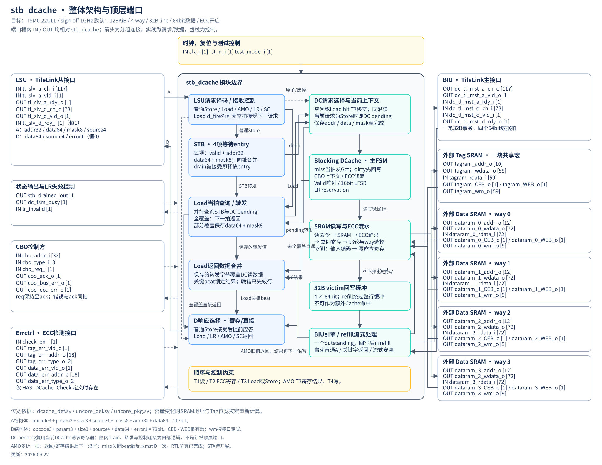
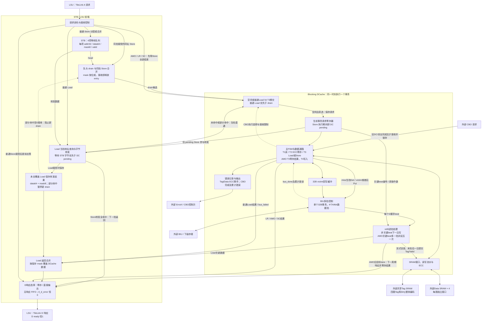
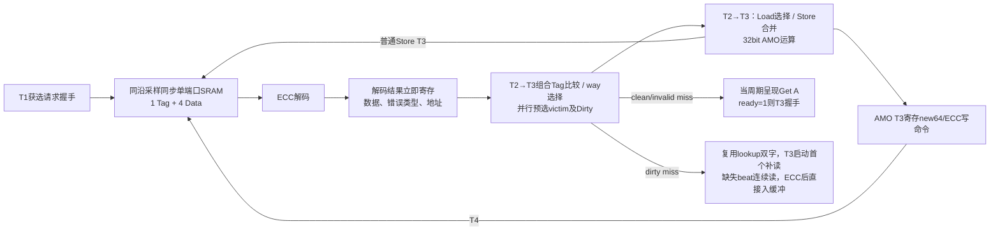
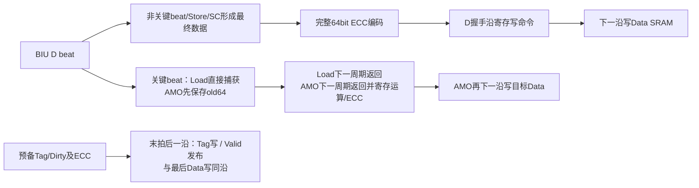

# stb_dcache 整体架构图

当前RTL真实例化层次、子模块端口及模块间交互信号见 [RTL实例级顶层框图](stb_dcache_rtl_hierarchy.md)。本文以下各图用于说明功能职责和数据流，不代表独立RTL模块划分。

依据当前 [LLD](stb_dcache_lld.md)，更新于2026-09-23。目标工艺TSMC 22ULL，要求sign-off达到1GHz；四路DCache，32B cache line，默认128KiB。图中方框表示逻辑职责，不限定RTL文件或模块划分。

## 顶层端口版

[打开可放大的SVG架构图](stb_dcache_ports.svg)

端口名按当前`stb_dcache.sv`逐项核对，覆盖全部61个声明端口（含`HAS_DCache_Check`条件内7个端口）。IN/OUT均以stb_dcache为参照；所有标为`[N]`的数字表示位宽，不是位索引。Tag SRAM和四路Data SRAM位于模块边界外；模块内保留SRAM接口、ECC与流水控制。

位宽按当前默认128KiB、128MiB地址窗口、ECC开启及Parity关闭配置展开：

| 接口 | 位宽与字段 |
| --- | --- |
| LSU/BIU A通道结构体 | 117bit：opcode3、param3、size3、source4、mask8、addr32、data64 |
| LSU/BIU D通道结构体 | 78bit：opcode3、param3、size3、source4、data64、error1 |
| Tag SRAM | addr10；wdata/rdata59；wm59；CEB/WEB各1bit |
| 每路Data SRAM | addr12；wdata/rdata72；wm9；CEB/WEB各1bit |
| CBO | addr32、type3；req/ack/bus_err/ecc_err各1bit |
| Tag/Data错误上报 | 每组valid1、addr18、type2；check_en_i为1bit |

SRAM位宽随配置按宏重新计算，图中数字不替代参数化声明。`CEB`和`WEB`低有效。`lr_invalid`、`stb_drained_out`、`dc_fsm_busy`保留原端口拼写，不添加`_i/_o`后缀。`drain_fire`、`pending_store_valid`和转发连接属于内部逻辑，不新增顶层端口。

## 1. 请求、数据和响应路径

实线表示请求或数据路径，虚线表示控制关系。DC pending位于DCache请求上下文中，表示已经接收且尚未完成的普通Store；与当前Load/原子/CBO事务互斥，不是额外并行执行单元。

图中`stb_drained_out`提供给上层Core作为CBO发令条件。上层等待STB及DC pending Store全部完成，并等待前一笔blocking请求结束后，才向本模块呈现CBO；因此模块接收后直接执行，不先锁存再排空STB。本Mermaid图用于说明逻辑路径，顶层端口名和方向见上方SVG图；内部ready、完成反馈、复位和常规寄存器控制未逐根展开。

## 2. SRAM 内部流水

Tag对四路Tag和Dirty整体编码，Data为64bit+8bit ECC；Valid独立寄存。普通hit的way选择不再寄存一拍；Store组合结果在T3写，AMO最终命令寄存后T4写。refill采用下图独立寄存写命令流水，无安装后重读。

## 3. 阅读要点

- **普通Store**：成功入队、合并或同拍合并下发后，下一响应周期返回AccessAck。drain被接受时entry释放，DC请求寄存器保存最终payload至提交或错误收尾，不重复应答。
- **Store转发全命中Load**：当拍查询同地址STB和pending；二者mask合计覆盖Load请求mask的全部字节才算全命中，下一拍直接返回，不访问SRAM。
- **未命中/部分命中Load**：同沿向LSU/DC握手并保存72bit转发结果，部分命中停新drain至D接收。DC miss从关键beat直接返回并覆盖STB字节；关键beat及此前error返回0且不覆盖STB，之后beat错误不改已确定结果、不撤回/补发D，包括后续错误与LSU D握手同沿。
- **请求顺序**：Load的D响应完成前不接后续LSU请求，d_fire完成沿可同时接受下一请求而不插空拍。AMO/LR/SC在模块内等待旧Store全部完成；CBO由上层等待`stb_drained_out=1`后才发送。真正排空为`stb_count==0 && !pending_store_valid`。
- **Miss**：LOOKUP_EVAL并行预选victim，clean/invalid当周期发Get、T3可握手；dirty在T3首读，必要回写完成后直接衔接Get，无MISS_SELECT/WB_START空拍。非关键beat下一沿写；AMO关键beat下一周期返回/寄存结果、再下一沿写，并反压mst D一个周期。末写和Tag/Valid提交后进入IDLE，不重读/重放。
- **提前响应后的占用**：Load d_fire沿即可接Store或Store转发全命中Load，DC仍可持有原refill；旧D消费与新D装载可同沿重叠。AMO早响应后仍保持原子互斥至整笔提交/错误收尾。
- **完成沿复用**：普通Load hit T3无修复/写冲突时同沿接下一DC请求并读SRAM；原子响应与工作均完成的沿也开放前台，不先空等F_IDLE。直接D与寄存D由互斥选择器输出。
- **Store单错修复**：普通Store hit使用纠正后的旧值形成完整新码字，以1FF业务写同时修复，不额外增加SCRUB写；AMO hit掩码写规则保持。
- **错误**：ECC单错纠正并修复，双错上报后继续；bus error只失效相关行，LSU的`tl_d_error`恒0。CBO专用累计错误与最终ack同拍输出。

这里只描述设计结构。首版RTL已通过参数化定向仿真；尚未使用TSMC 22ULL目标库完成综合、布局布线和1GHz sign-off STA。详细状态、寄存器生命周期和周期定义以LLD为准，实测范围见[RTL实现与验证状态](stb_dcache_rtl_status.md)。
