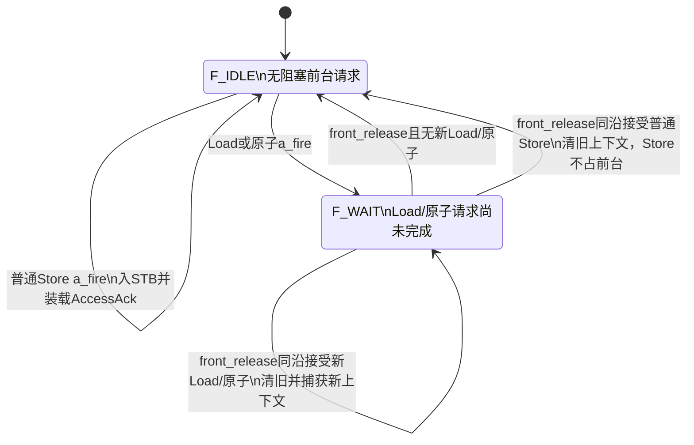

# stb_dcache LLD v1.0

创建日期：2026-09-21；更新日期：2026-09-23。状态：详细设计实现基线；首版RTL已按本基线完成并通过参数化定向仿真，结果见[RTL实现与验证状态](stb_dcache_rtl_status.md)。尚未开展TSMC 22ULL目标库综合、布局布线或sign-off STA。

本文将已讨论的架构细化为寄存器、事件、状态和周期边界。配套 [架构文档](stb_dcache_architecture.md) 说明参数和取舍，[评审记录](stb_dcache_review.md) 记录用户确认。本文不将未开展的仿真、综合、STA 标为通过。后续如改变本文周期或外部行为，先更新本基线。

## 1. 固定的外部行为

1. 顶层端口以当前 stb_dcache.sv 为准，flush_ex2 已删除；不新增 VC 或其他顶层接口。
2. tl_slv_d_rdy_i 恒为 1；tl_slv_d_ch_o.tl_d_error 无条件为 1'b0。error 不参与 SC 成败编码。
3. 普通 Store 成功入队、合并或同拍合并至 drain 即应答；后台完成不重复应答。drain 被 DCache 当拍接收即出队，DCache 保存最终合并的 Store 至正常或错误收尾。
4. SC 返回 AccessAckData：成功为整个 64bit 的 0，失败为整个 64bit 的 1。reservation 失败不读写 SRAM；需要访问下级但失败、未完成写入时也以 SC 失败状态结束。
5. AMO为32bit RMW，返回修改前目标32bit字，另一半补零。hit业务写为9'h10F/9'h1F0；miss将new32和refill原另一半直接组成完整64bit，按9'h1FF安装并编码ECC，不再进行额外半字写。LR使用同样的返回lane布局。
6. Load miss在关键beat接收沿装载D响应，下一周期返回；AMO先保存关键旧值，下一周期返回旧值并寄存运算/ECC结果，详见第16条。响应错误判定以关键beat握手为界：关键beat或此前出现bus error则返回64'd0且不叠加转发；关键beat之后的beat报错均按晚到错误处理，只使相关行保持invalid，不改动已确定的响应、不撤回、不补发、不向LSU报错，即使后续beat报错与LSU D握手同沿。LR仍在整笔成功后返回/建锁，出错返回0；SC保持第4条约定。victim回写失败、未进入refill的读/AMO返回0。
7. 普通 Load 对尚未接收的 STB drain 优先；已接受事务执行到结束。AMO/LR/SC 在模块内等待更早 Store 完成；上层 Core 只有在 `stb_drained_out=1` 且前一笔 blocking 请求完成后才发送 CBO。无强制轮转公平性。
8. CBO req 保持至 ack，只执行一次；该命令内发生过的 bus error、ECC 双错分别记录，和 ack 同拍输出。单错不设置 cbo_ecc_err_o。
9. ECC 双错上报后继续当前操作；单错使用纠正值并在当前事务内修复。check_en_i 只控制常规 Tag/Data 事件上报。
10. Cache 四路、32B line、64bit 数据；默认128KiB，支持16/32/64/128KiB；固定使用全局16bit LFSR替换，先选编号最低的invalid way，四路全有效时使用LFSR[1:0]。
11. 目标工艺为TSMC 22ULL，`clk_i`必须sign-off达到1GHz，时钟周期1.000ns；这是2026-09-23进一步明确的验收要求，尚未获得目标库综合、布局布线及sign-off STA达标结果。
12. STB 为4项等待条目，同双字地址可匹配任意有效项合并，mask 按位或；满且不能合并时 tl_slv_a_rdy_o=0。普通 Load 在Store转发源中全命中时下一拍返回；未命中或部分命中时当拍直通 DCache，是否接受取决于 DCache 空闲和仲裁条件。
13. 部分命中Load接受时保存转发结果并停止新drain，至该Load D响应被接收才解除；Load完成前不接受后续LSU A，但其`d_fire`完成沿可同时接受下一请求，不插空拍。同地址普通Store与drain同拍均被接受时合并下发，只释放原entry，不重复入队；不设置drain_hold。
14. refill按实际D握手逐beat安装，不先收整行再安装、不重新lookup或重放。普通refill最后beat接收后的下一沿完成最后Data/Tag写和Valid发布。该提交沿因单端口SRAM正在写，不同时接受需要读SRAM的新DC请求；提交后下一周期可作为新请求T1。关键beat响应不提前释放owner。
15. 正常hit固定为：T1请求握手与Tag/Data SRAM采样读同沿，T2寄存ECC解码结果；普通Load在T3被LSU接收，普通Store在T3写Data及必要Tag Dirty。AMO再拆一拍：T3返回旧值并寄存AMO运算后的完整新值/ECC及写命令，T4实际写Data及必要Tag Dirty，随后释放原子占用。
16. AMO miss的关键beat同样拆一拍：C0在mst D握手捕获关键字，C1返回旧值并寄存AMO结果/ECC，C2写目标Data。用户已确认保留此LLD时序，不将目标Data实际写入提前到C1。为避免与下一refill beat争用单端口Data SRAM，成功关键beat之后对mst D反压一个周期；C2可在写AMO结果的同沿接收下一beat。非关键beat仍在其mst D握手后的下一沿写入。
17. LOOKUP_EVAL内并行预选victim并判断miss；无待修复阻碍且victim无效/干净时，当周期直接呈现Get A，ready=1则T3握手。不设置独立MISS_SELECT或BIU启动空拍；脏victim先完成回写，ZERO不发Get。

## 2. 控制边界和内部接口

首版顶层内部按四个逻辑区域实现，可放在一个 RTL 文件中，避免先引入不必要的模块端口：

| 区域 | 职责 | 允许并行的活动 |
| --- | --- | --- |
| STB/Load 前端 | 普通 Store 入队/合并、应答；Load 转发快照、D 返回；原子请求接受 | DCache 处理 Store 时可继续入队或处理Store转发全命中Load |
| DCache 主 FSM | 一个 owner 事务的 lookup/修改/miss/CBO 流程 | 执行期间只有本 owner 使用 SRAM |
| SRAM数据路径 | 请求握手沿直接读、ECC后寄存；普通Load/Store从ECC寄存结果在下一沿返回/写入；AMO增加结果写命令寄存 | Tag/Data独立可同拍写，同一宏每拍最多一操作；原始SRAM rdata不组合反馈写端口 |
| BIU 引擎 | 一次32B读或写，A/D 握手及错误累计 | STB 前端可继续运行；不并发第二笔 BIU 事务 |

内部事件全部在 clk_i 上升沿采样：

```
a_fire       = tl_slv_a_vld_i && tl_slv_a_rdy_o
d_fire       = tl_slv_d_vld_o             // rdy_i 恒1
dc_can_accept = dc_idle || normal_load_hit_turnover
drain_fire   = dc_can_accept && (stb_count != 0)
            && (!stall_drain || normal_load_release) && !higher_priority_dc_grant
bus_a_fire   = dc_tl_mst_a_vld_o && dc_tl_mst_a_rdy_i
bus_d_fire   = dc_tl_mst_d_vld_i && dc_tl_mst_d_rdy_o
stb_drained  = (stb_count == 0) && !pending_store_valid
```

normal_load_hit_turnover只在旧owner为普通Load、LOOKUP_EVAL确认hit、本沿完成D握手、无待修复/维护/在途SRAM写时有效；不是任意owner_done的旁路。旧Load在T3使用T2寄存结果输出，同沿SRAM可采样下一请求。drain是内部当拍候选选择，只有drain_fire采样沿移交payload，不冻结候选head。higher_priority_dc_grant为本拍实际获选的Load或原子；CBO由上层等待`stb_drained_out`后才呈现，不参与排空期间的内部仲裁。stall_drain只由对应部分命中Load的D握手清除，该完成沿可开放新drain。外部LSU/BIU仍遵守valid/ready保持规则。

内部 payload：drain={addr,data,mask}；dc_req={owner,addr,data,mask,opcode,param,size}；dc_result={data,bus_failed}。source/size 留在 LSU 上下文用于应答；普通 Store 的 source/size 只需复制到当拍产生的输出响应，不随后台 Store 保留。

dc_result.bus_failed是内部结果选择控制，不连接LSU tl_d_error。普通Load/AMO refill的结果只使用截至关键beat握手的错误快照critical_err，不能在D消费时重新使用持续变化的整笔err_seen。victim回写失败、LR/SC整笔失败仍按各自收尾规则选择零/SC失败。response_issued防止重复结果事件；critical_seen后即使AMO尚未输出D，也不能用后续beat错误改写已确定的响应。DC事务收尾与LSU响应分开，旧refill晚到错误不能覆盖该响应、较新前台请求或独立的转发Load。

## 3. 寄存器与生存期

下表按逻辑信息描述，互斥生命周期字段可以物理复用；并行生存的 STB pending 与 Load 上下文不得复用而覆盖。

| 寄存器组 | 字段/位宽 | 建立与释放 |
| --- | --- | --- |
| STB 等待条目×DEPTH | valid、addr32、data64、mask8；默认DEPTH=4 | a_fire 分配/合并；drain_fire 释放；同拍合并下发不重复存入条目 |
| STB 指针与计数 | head/tail 宽度 max(1,clog2 DEPTH)，count 为 clog2(DEPTH+1) | 同拍 push/pop 一次 next-state 更新；非2次幂显式回绕 |
| stall_drain | 1bit | 部分命中Load a_fire置位，所属Load d_fire清零；同沿又接受新部分命中Load时置位优先，复位为0 |
| DCache 请求上下文 | owner 枚举、addr32、data64、mask8、opcode3、param3、size3 | DC 接收至 owner 完成；Store owner 时即 pending Store 转发源 |
| pending_store_valid | 1bit，可由 owner 有效且为 Store 解码 | drain_fire 建立，store_done 清除 |
| LSU 前台上下文 | valid、kind、addr32、source4、size3、mask8、AMO param/operand | Load/原子a_fire建立；普通Load在d_fire释放，同沿新Load/原子捕获优先于旧上下文清除；原子请求须响应消费且DC收尾才释放 |
| Load 转发保存 | forward_mask8、forward_data64，共72bit | 当拍组合查询，未全覆盖 Load a_fire 保存结果至 D 响应；STB 字节优先于 pending |
| D输出 | 寄存路径valid、opcode、size、source、data；直接路径选择；param/error常量0 | hit由T2结果在T3直接握手；AMO miss由critical_old64直接返回；其他指定结果沿上装载寄存路径；旧d_fire与新响应装载同沿时新装载优先，无FIFO |
| 原子完成记录 | atomic_response_done、atomic_work_done | 属于LSU前台，分别记录本原子的响应消费与DC工作结束；保留至前台释放，新原子捕获优先；SC reservation失败接受时work_done置1 |
| CBO 上下文 | active、armed、type3、addr32、bus_seen、ecc_seen | 上层已确认`stb_drained_out=1`且前一笔blocking请求完成后才呈现命令；模块接受时建立，完成沿清active并装载ack；看到req低后重置armed |
| CLEAN_ALL 游标 | set[TAG_INDEX_W]、way2 | CBO 开始清零，扫描步进直到最后 set/way |
| Lookup 解码结果 | tag_raw[TAG_RAW_W]、4×data64、各单/双错、rd上下文、valid_way4 | 有效 SRAM 读后一拍捕获 ECC 结果，owner 独占期间不被覆盖 |
| Lookup选择/执行结果 | hit、hit_way2、selected_data64、AMO new64/ECC、target_way、目标Tag/Dirty | T2→T3组合选择；Load直接响应、Store直接写；AMO在T3寄存新值/ECC及写命令供T4写入 |
| 32B 行缓冲 | 4×64bit、beat_valid4、repair_mask4、每beat错误/报告标记 | victim ECC结果直接寄存；可复用本次lookup已读的目标way双字，只补读剩余beat；四拍A与D应答均完成才释放；refill绕过整行缓冲 |
| victim 信息 | line_base32、set、way、dirty | 选定 victim 至 writeback/错误收尾；与原请求地址分开保存 |
| SRAM写暂存 | data_raw64、tag_raw、地址/CEB/WEB/wm、编码命令寄存器 | 普通Store hit从ECC寄存结果直接组合写；AMO hit在T3、miss关键beat在C1寄存最终写命令；非关键refill beat在D握手沿寄存写命令 |
| AMO等待写 | valid、data_code、data_addr、data_wm、tag_code/need_tag | hit的T3或miss关键beat的C1建立，下一沿SRAM采样后清除；valid期间保持原子owner，不重复响应 |
| Refill上下文 | critical_beat2、critical_seen、critical_err1、critical_old64（LR结果可复用）、response_issued、last_write | 属于DC owner；关键beat握手时保存含本拍错误的critical_err，之后不被其他beat修改；寄存响应装载或直接响应发出时置response_issued；末写提交后释放，原子完成记录独立保留在前台 |
| 安装Tag准备 | tag_code[dcTagRamWidth]、prepared_valid、target_set/way、new_allocation | BIU等待时提前形成Tag/Dirty并编码；仅最后beat无累计错误时发Tag写，提交同沿发布Valid |
| BIU 状态 | op、base32、A/D拍计数各3bit、ack_seen、err_seen；owner侧bus_started | 一笔事务开始至完整协议收尾；阶段启动沿置bus_started防止重复发起 |
| reservation | valid、双字基址32、mask8；lr_killed1 | LR执行期间记录外部失效；成功LR完成建立，SC/CBO/冲突Store等清除 |
| Valid | SETS×4bit | 复位/INVAL_ALL清全表，安装置位，单行失效清对应位 |
| 替换状态 | 全局16bit LFSR | 复位为非零种子；仅新行成功安装后推进 |

Load 在请求当拍完成地址匹配和字节选择，a_fire 使用沿前 STB/pending 状态。完全覆盖时直接装载 D 输出；未全覆盖时仅保存合并后的72bit转发结果，不保存各源副本。这样同拍出队或 pending 完成也不会丢失该 Load 的转发值。当拍查找、ready 选择和数据选择路径必须按1GHz目标检查，不能擅自增加查询流水而改变已约定延迟。

## 4. 前端接受与 STB 同拍规则

前台只保留`F_IDLE`、`F_WAIT`两个状态，D响应是否待发送由独立`d_valid`表示。普通Store不占长期前台上下文；Load不增加接收后的查询或派发等待拍。

| 前台状态 | 条件与动作 | 下一状态 |
| --- | --- | --- |
| F_IDLE | 普通 Store a_fire，分配/合并 STB 或同拍合并至 drain，装载 AccessAck | F_IDLE |
| F_IDLE | 普通Load在Store转发源中全命中且a_fire，直接把转发数据装入D输出 | F_WAIT，下一沿d_fire完成 |
| F_IDLE | 普通Load在Store转发源中未命中或部分命中，组合直通DC；LSU与DC在同沿接受，保存转发结果；部分命中置stall_drain | F_WAIT |
| F_IDLE | 原子请求且 Store 全部结束、DC 空闲、旧 D 输出已消费，LSU 与 DC 同沿接受 | F_WAIT |
| F_IDLE | Load 未全覆盖但 DC 不能接受，或原子排空条件未满足；a_ready=0，不捕获请求 | F_IDLE |
| F_WAIT | 普通Load尚未d_fire | 保持F_WAIT，不接受后续A |
| F_WAIT | 普通Load d_fire，本沿无新请求被接受 | 清旧上下文/stall_drain，到F_IDLE；旧DC owner可继续refill |
| F_WAIT | 普通Load d_fire，同沿接受新普通Store | 清旧Load；Store入队/合并并装载下一AccessAck，到F_IDLE |
| F_WAIT | 普通Load d_fire，同沿接受新Load/原子 | 清旧上下文后捕获新上下文，保持F_WAIT；新请求捕获具有最终优先级 |
| F_WAIT | AMO hit在T3消费旧值D并寄存运算/ECC写命令；miss在关键beat后C1消费旧值并寄存写命令 | 保持F_WAIT和原子互斥，不再发第二个D |
| F_WAIT | AMO写命令在下一沿实际写入；hit到此完成，miss继续剩余refill | hit满足atomic_release后按同沿新请求决定状态；miss等待全行提交/错误收尾 |
| F_WAIT | 原子响应和DC工作均已完成，包含本沿完成事件 | atomic_release=1，同沿开放下一请求；新Load/原子接受则保持F_WAIT，否则到F_IDLE；新请求仍须满足SRAM/队列等资源条件 |

同沿释放/接受使用next-state统一计算，不能用两个独立always块互相覆盖：

```
normal_load_release = (front_state == F_WAIT)
                   && (front_kind == NORMAL_LOAD)
                   && d_fire;
atomic_release = (front_state == F_WAIT) && front_is_atomic
              && (atomic_response_done || front_atomic_d_fire)
              && (atomic_work_done || front_atomic_owner_done);
front_release = normal_load_release || atomic_release;
front_accept_window = (front_state == F_IDLE) || front_release;
d_slot_available    = !d_valid_q || d_fire; // rdy_i固定为1，旧槽本沿可释放

front_valid_next = front_valid;
if (front_release)
    front_valid_next = 1'b0;
if (a_fire && (new_req_is_load || new_req_is_atomic))
    front_valid_next = 1'b1;       // 同沿新上下文捕获优先

d_valid_next = d_valid_q && !d_fire;
if (new_d_response)
    d_valid_next = 1'b1;           // 同沿新响应装载优先

stall_drain_next = stall_drain;
if (normal_load_release)
    stall_drain_next = 1'b0;
if (a_fire && new_load_partial_hit)
    stall_drain_next = 1'b1;       // 新部分命中置位优先
```

`new_d_response`包括本沿接受的普通Store AccessAck、Store转发全命中Load结果和SC reservation失败结果。payload、source、size与valid一起由新响应覆盖；不能只更新valid而遗留旧payload。

front_atomic_d_fire和front_atomic_owner_done仅属于沿前的当前原子上下文，不能由新请求或其他owner的事件置位。两项完成记录跨拍OR保持；前台释放时清旧记录，同沿接受新原子时以新请求初始化为最终优先。正常原子初始化两项为0；SC reservation失败初始化work_done=1，只等待下一沿消费D=1。不能将两个单周期事件直接相与作为释放条件，也不能在DC owner释放时清掉尚未消费响应的前台记录。

D输出由寄存响应与直接响应两路选择：两路valid必须互斥并用断言检查，不通过优先级丢弃响应。普通Load/AMO hit在T3直接握手，AMO miss在关键old64捕获后的下一沿直接握手；这些路径不再经过一级最终D寄存器。直接响应消费同沿可以装载下一请求的寄存响应；旧source/size/data仍取沿前上下文。

### 4.1 Store 接收与写入合并

普通 Store 为 PutFullData/PutPartialData，须先排除 SC 等特殊 param 编码。比较输入 addr[31:3] 与所有有效等待 entry 的 addr[31:3]；任意一项命中即 can_merge，维持同一双字最多一个等待 entry 的不变量。DCache pending 可以与等待 entry 同址，但不得直接修改已接收的 pending。

```
store_ready   = front_allowed && (can_merge || !stb_full)
merged_mask   = old_mask | incoming_mask
merged_data[b]= incoming_mask[b] ? incoming_data[b] : old_data[b]
bypass_merge  = a_fire && normal_store && drain_fire && same_doubleword_as_head
alloc_fire    = a_fire && normal_store && !can_merge
count_next    = count + alloc_fire - drain_fire
```

front_allowed要求`front_accept_window`有效、无CBO/原子互斥限制且所需响应槽可用。普通Store和转发全命中Load会产生新D寄存响应，要求`d_slot_available=1`；在旧Load d_fire沿该条件成立，可消费旧D并装入新D。ready仍使用沿前STB满状态，不依赖drain_fire：满且命中ready=1，满且未命中ready=0，即使本拍出队也不提前分配。非满且未命中分配tail；合并不推进tail，head只在drain_fire推进。

### 4.2 drain 与输入 Store 同拍

STB 规则：

- bypass_merge=1：以输入 mask 选择新字节、mask 按位或，DCache 捕获合并后的完整 payload；释放 head，不写回该 entry、不另分配。输入 Store 仍独立产生一次 AccessAck，旧 Store 不重复应答。
- 输入命中 head 但 drain_fire=0：只更新该等待 entry，保持可合并，不冻结 head。
- 输入命中非 head 且 head 同拍 drain：更新命中 entry，释放 head，count 减一。
- 输入未命中且非满：分配 tail；若同拍 drain，count 不变；否则 count 加一。
- 满且未命中：输入不被接受；已有 head 仍可独立 drain，空间下一拍可用。空队列先入队，最早下一拍 drain。
- drain 下发地址为双字对齐地址，mask 使用合并后的值；mask=FF 时 opcode=PutFullData，否则 PutPartialData；内部 size=3、param=0。LSU 应答保留各输入请求原 source/size。
- store_done 只清 DC owner/pending，绝不弹 STB。已接受普通 Store 在接收时处理 reservation 冲突失效，包括 bypass_merge。

### 4.3 Load 当拍查找与部分命中

处于`front_accept_window`的有效普通Load当拍并行查询等待STB和pending Store，包括旧普通Load d_fire的释放沿。等待队列每个双字最多一个匹配项，每字节优先取该项，再取较旧pending；两者都没有则forward_mask对应位为0。合计mask覆盖请求mask即转发全命中。

```
stb_match        = stb_valid[i] && (stb_addr[i][31:3] == load_addr[31:3])
pending_match    = pending_store_valid && (pending_addr[31:3] == load_addr[31:3])
forward_mask     = (stb_match ? stb_mask[i] : 8'h00)
                 | (pending_match ? pending_mask : 8'h00)
forward_full_hit = (forward_mask & load_mask) == load_mask
```

因此这里的“全命中”不是只比较地址。以64bit Load、`load_mask=8'hFF`为例，同地址STB条目只有`mask=8'h0F`仍是部分命中，必须读取DCache后用低4字节转发值覆盖；STB与pending的mask合计为`8'hFF`才是转发全命中。两者同一字节都有效时，较新的等待STB数据覆盖较旧pending数据。

- 转发全命中：不向DC发读；a_fire沿装载D寄存器，下一拍返回。DC忙不阻止；允许同拍drain，返回值取沿前源数据。在旧Load d_fire沿接受时，旧D先消费、新D在沿后有效，响应顺序不变。
- 未命中或部分命中：请求当拍组合送往DC，并优先于新drain；a_ready取决于dc_can_accept及调度允许，LSU a_fire与DC接受必须同沿发生。当前DC不空闲且不满足普通Load hit同沿移交时a_ready=0，上游保持请求，前端不先收再排队，不重复发起已接受请求。
- 部分命中接受时保存forward_data/mask，置stall_drain；接受沿由Load获选阻止drain，其D消费前不接受新drain，d_fire完成沿可解除限制。已开始的事务不能被暂停；DC尚有pending Store时，该部分命中Load先等待其完成才被接受。
- DC hit结果或miss关键beat按保存mask覆盖后返回；miss在关键beat握手时若累计bus错误（含该beat）为1则固定返回64'd0，不覆盖转发。之后的beat报错只失效原行，不改变该响应，包括与D消费同沿的错误；不再使用已释放/复用的前台转发上下文。Load的D未消费前不接后续LSU请求，但d_fire完成沿可释放旧上下文并捕获新请求。
- 未握手的 Load 每拍重新查询，不能提前锁存过期转发结果。上层等待`stb_drained_out`期间不向本模块呈现CBO；如何阻止新的LSU请求并保证已有Store最终排空属于上层Core的发令控制。

### 4.4 原子排空边界

AMO/LR/SC只有在(stb_count==0) && !pending_store_valid、dc_can_accept且较早响应已消费或在本沿消费时才接受。仅队列empty不够，最后一项刚被DC接收时仍不得接受原子请求。pending在SRAM提交或bus-error协议收尾后才清除；等待排空的原子请求不阻止旧Store drain。

AMO关键beat返回后仍保持原子互斥，直到AMO写入且整行提交或错误收尾；响应与工作两项完成条件均满足的沿开放前台。若DC工作较早完成，最终d_fire沿即可接受下一请求，不先空等F_IDLE。最后SRAM写沿不能接受需要读同一宏的新DC请求，但可按资源条件接收普通Store等前台请求；下一周期恢复DC接收。

### 4.5 前台状态机与同沿释放/替换

`F_*`只描述LSU前台请求的占用情况，不代替DCache主FSM；D响应等待由独立`d_valid`表示。`F_IDLE`也不保证DCache空闲：普通Load关键字返回后旧refill可继续收尾。请求最终ready还要检查STB容量/合并、DC是否能接受、原子排空、CBO限制和D响应槽。



Store转发全命中Load在`F_IDLE`接受后进入`F_WAIT`，A握手沿装载D寄存器，下一周期在`F_WAIT`完成d_fire。若该d_fire沿又来一笔请求，不要求状态先经过一个完整`F_IDLE`周期：普通Store可以入队/合并，新转发全命中Load可以替换上下文并装载下一D，需访问DC的Load只在DC当沿确实能接受时握手。

| 旧请求完成沿的新输入 | a_ready/动作 | 沿后前台与D输出 |
| --- | --- | --- |
| 无新请求 | 不发生a_fire | `F_IDLE`，旧D清除 |
| 普通Store，可合并或STB未满 | a_ready=1；按原规则合并/分配 | `F_IDLE`；新AccessAck覆盖已消费旧D，下一周期返回 |
| 普通Store，STB满且不能合并 | a_ready=0 | `F_IDLE`；请求由上游保持到以后接受 |
| 新Load转发全命中 | a_ready=1 | `F_WAIT`；新data/source/size覆盖已消费旧D，下一周期返回 |
| 新Load部分/未命中且DC可接受 | a_ready=1；同沿为新请求T1 | `F_WAIT`；捕获新上下文，部分命中重新置stall_drain |
| 新Load需要DC但旧refill仍占用DC | a_ready=0 | 旧Load释放到`F_IDLE`；新请求由上游保持，转发全命中则不受此限制 |
| AMO/LR/SC | 仅STB、pending、DC、D槽等原子条件均满足才接受 | 接受则`F_WAIT`，否则旧请求释放后为`F_IDLE` |

同沿查找和写入都使用沿前STB/pending内容；新Store的写入在该沿后生效。旧部分命中Load的forward快照已经进入D结果，不再依赖活动entry，因此同沿新Store不会改变正在消费的旧D。旧上下文清除、`stall_drain`清除和`d_valid`清除均低于同沿新请求捕获/新响应装载的优先级，保证无空拍替换不丢请求、不丢响应。

普通Load d_fire只释放LSU前台，不一定释放旧DC owner。旧miss refill尚未结束时仍允许新普通Store或Store转发全命中Load；需要访问DCache的新Load继续反压。普通Load hit无修复/写冲突时，T3可直接移交DC给下一请求。AMO响应d_fire不能单独打开接收窗口，须按两项前台完成记录和本沿事件共同计算atomic_release。

CBO使用独立的`C_IDLE/C_RUN/C_WAIT_LOW`控制，不设置`C_DRAIN`。`stb_drained_out`由本模块输出给上层Core；上层必须等它为1且前一笔blocking请求完成后，才呈现`cbo_req/type/address`。因此CBO到达本模块时STB已经排空，不允许先锁存CBO再等待STB。模块在DC空闲且前台安静时接受并执行；C_WAIT_LOW中已经处理过的高req不继续阻止LSU。

## 5. DCache 状态与转移

正常hit不为读命令单独增加状态：IDLE获选请求的同一沿直接启动SRAM读。T2 ECC结果寄存后进入LOOKUP_EVAL；普通Load/Store在T3完成，AMO在T3返回并寄存写命令、T4写入。SC及ECC修复可调用写微操作。refill使用逐拍写流水；owner保持到实际提交/错误收尾。

### 5.1 主控制状态

| 状态 | 执行动作 | 离开条件/目标 |
| --- | --- | --- |
| IDLE | 组合选择请求；握手沿直接读SRAM并锁存上下文；普通Load优先drain；SC在同沿前检查reservation，接受即清锁 | SC失败装载D=1且不读SRAM；通过的SC及其他查找请求到LOOKUP_ECC；CLEAN_ALL启动扫描；INVAL_ALL在取得执行权的沿清全部Valid并产生完成事件 |
| LOOKUP_ECC | SRAM读出做ECC解码，T2沿寄存Tag/Data raw、错误标志及请求上下文 | T2后进入LOOKUP_EVAL |
| LOOKUP_EVAL | T2→T3形成hit/way；并行按Valid/LFSR预选victim、选取其Dirty；Load响应、Store组合合并/ECC写、AMO形成旧值D与new64/ECC写命令；上报ECC事件 | T3：Load/Store hit完成；普通Load满足移交条件且新DC读被接受时直接到LOOKUP_ECC，新上下文优先；否则完成后IDLE。AMO hit到AMO_WRITE；clean/invalid miss当拍发Get并到REFILL，dirty miss锁存victim并直接启动首个victim读，到VICTIM_READ；CBO在本态直接决策，详见5.3 |
| AMO_WRITE | 保持AMO hit在T3寄存的最终Data/Tag写命令 | T4 SRAM采样写入，清命令、释放owner；AMO miss始终留在REFILL，用处理阶段/命令valid控制额外一拍 |
| SCRUB | 已寄存的纠正数据重编码并写回；Tag与选中Data可并行修复 | 完成返回保存的正常继续状态；不重读、不重复上报 |
| EXEC | 仅在修复后仍需实际业务写等操作时使用；不用于纯分支、结果搬运或完成通知 | 完成实际操作的沿直接产生完成事件或启动下一操作；AMO已返回旧值不得再次响应 |
| VICTIM_READ | 复用有效lookup双字后，只连续补读缺失beat；ECC结果按beat直接寄存进行缓冲，读发出与前一读返回重叠；错误标记同拍保存 | 最后一项寄存的沿转WB_WAIT；无错则随后周期直接呈现首Put，无WB_START空拍 |
| WB_WAIT | 首先检查已寄存repair_mask，有待修复则SCRUB后返回；全行就绪、无待修复、BIU空闲且本阶段未启动时组合发起Put，随后等全部A拍及D应答 | error当沿失效victim并完成/推进扫描；替换成功当沿转REFILL或ZERO_WRITE，Get最早在随后一沿握手；CLEAN/FLUSH/CLEAN_ALL成功到CBO_TAG |
| REFILL | 发Get并逐D握手安装；非关键beat下一沿写。Load关键beat下一周期响应。AMO关键beat先保存，下一周期响应并寄存运算/ECC写命令，再下一沿写；其间反压一个D周期 | 无错且最后一个在途Data写完成时同沿写Tag/置Valid；AMO关键写未完成不得发布；提交后到IDLE，下一周期再接请求 |
| ZERO_WRITE | 零数据源复用安装写流水，连续四个完整Data写；提前准备Dirty=1的Tag | 末Data与Tag同沿提交/发布，完成CBO；无refill、无独立PUBLISH状态 |
| CBO_TAG | 回写成功后清选中Dirty；FLUSH同时失效；共享Tag重新编码并实际写回 | 写提交沿单行操作完成；CLEAN_ALL更新Tag快照并推进扫描，无额外完成/游标状态 |
| SCAN | 每set读一次Tag并经过ECC寄存；对尚未处理的valid且dirty四位mask作选择，全invalid set跳过SRAM | 有待处理脏way则锁存并启动victim读；无则直接推进set/结束；单错先修复Tag；不逐个空way插入SCAN_NEXT |

SC_CHECK、MISS_SELECT、WB_START、CBO_ACTION、SCAN_NEXT、INV_ALL、BUS_FAIL、FINISH仅描述原表中的动作，均不再编码为独立主状态。没有SRAM/总线操作、必要寄存边界或明确等待条件的动作，不单独占一个周期。

所有 SRAM 完成条件都是宏实际采样命令之后，不以“已算出写数据”代替写入完成。正常 Store/AMO/SC 写Data并更新Dirty时，两块独立SRAM可同时提交；若Dirty原来为1且Tag无待修复，则不写Tag。

REFILL进入前保证victim已安全回写或无需回写、目标Valid已清、共享安装Tag可及时就绪。Load/LR安装Dirty=0；Store/SC/AMO/ZERO为1。已有error后不发新的有效Data写，但已在途的写可完成；始终禁止该行发布。失效的部分Data不必回滚，不能声称出错时从未写过SRAM。

单错修复是异常路径。AMO hit可在T3返回纠正旧值并保存最终new64；若Data单错，先完整修复旧码字，再执行10F/1F0业务写，保持互斥且不重复响应。普通Store hit则使用纠正后完整old64合并新字节、重新编码，在T3以1FF业务写同时修复Data单错，不另走SCRUB；Tag单错也可与最终Dirty更新合并为同沿Tag写，单错事件仍只上报一次。普通Load单错仍先修复；其他不能被完整业务写覆盖的维护修复继续使用SCRUB。

LOOKUP_EVAL分支：无错普通Load/Store hit在T3直接完成；AMO hit在T3响应并建立AMO_WRITE，T4完成；LR hit在T3返回并按lr_invalid/lr_killed建锁，SC hit在T3完成Store写并装载成功D寄存器，下一沿消费。miss和CBO在本态直接选择下一实际操作，详见5.3。修复不重复报告同一事件。

SRAM读命令记录启用的Tag/Data mask；解码寄存器只更新本次实际读取部分。victim仅读选中Data way时，不能把未使能的Tag输出覆盖掉lookup/scan保存的Tag快照。CLEAN_ALL处理完一条脏way并写回Tag后，同步更新快照中的该Dirty位，然后继续本set下一way。

LOOKUP miss时不报告无关Data way的错误；若选中valid dirty victim并复用本次lookup的该way双字，此时检查其已寄存错误，归属victim收集，其他way仍不报告。其余victim beat在实际补读后检查。全invalid set的Tag读值不可信且不报错，以零raw初始化。Tag双错继续使用解码器输出；若因此产生多路hit，确定地选最低编号hit，断言同时记录多hit，避免不确定的多路写使能；不自行新增暂停机制。

### 5.2 BIU 子状态

| 子状态 | 操作 |
| --- | --- |
| B_IDLE | 启动直通：start_get/put当周期直接驱动A valid/payload，不先寄存启动再等一拍；沿上保存上下文，并按本沿实际A/D握手决定计数与下一状态 |
| B_GET | 已保存Get但A尚未被接受，稳定保持A直到握手；已在启动沿被接受的Get直接到B_REFILL，不再经过本态 |
| B_REFILL | 接收剩余D拍，直接驱动refill写流水/关键beat结果，累计error；第四拍握手产生bus_done并回B_IDLE，DC仍等待最后SRAM写提交 |
| B_PUT | 发送尚未握手的Put A拍；启动沿若已发出beat0则从beat1继续，否则从beat0继续；地址恒定，反压payload保持；D应答保存ack_seen/error |
| B_ACK | A四拍均发完而D尚未到达，等待应答；完成沿产生bus_done并回B_IDLE |

主FSM与BIU并行：主REFILL可对应B_GET/B_REFILL以及总线结束后的B_IDLE；主WB_WAIT可对应启动周期的B_IDLE、B_PUT或B_ACK。start只被接收一次，主owner保存bus_started，不能因BIU回到B_IDLE而重发；回写转refill时开始新的阶段并清该阶段启动标记。

启动Get时A valid不依赖A ready；A被反压也必须在启动沿保存base/目标way/操作上下文。若启动沿A握手，B_IDLE直接转B_REFILL；首个D最早在该握手后的下一拍接收。D ready只在寄存的A握手计数非零后拉高，不接受未启动、首A同拍或多余响应。

回写完成与下一Get采用相邻边沿：W0接收旧Put的完成应答并直接进入REFILL，W0后用B_IDLE启动直通呈现Get，ready=1则W1握手。W0的D只归旧Put，不同时被当作新Get的首拍；不增加WB_START、B_DONE或额外空闲等待周期，也不要求旧D输入组合贯穿到新Get的A valid。

计数与完成判断使用本拍握手后的next值，支持最后Put拍与应答同拍，但不支持首个A与首个D同拍。若Put应答早于最后A拍，仍发完全部数据拍才done。D ready依据事务类型、接收槽位和已寄存的A握手进度生成；不接受未启动、首A同拍或多余响应。错误refill仍要求BIU给完四拍，不因error而提前停收。

B_PUT中最后A与已到/同拍D共同满足完成条件时，也在该沿产生bus_done并回B_IDLE。bus_done为完成事件，不再设置B_DONE空转状态；累计错误必须包含同沿新D的error。

### 5.3 冗余周期检查与消除

| 检查点 | 修订后的动作与边界 |
| --- | --- |
| miss选择/启动 | invalid优先选择、LFSR候选及候选Dirty与Tag比较并行；miss结果只作最终使能。clean/invalid时T3 Get可握手，dirty时T3可采样首个缺失victim beat读；未修复Tag单错先按SCRUB处理 |
| victim采集 | 本次lookup已读且ECC寄存的victim双字直接复用，只补读另外3拍；SCAN等无可复用Data时读4拍。缺失beat连续发读，下一沿ECC直接寄存进行缓冲，不逐拍等待或多复制一拍 |
| 回写启动 | 最后一项ECC结果寄存后进入WB_WAIT；根据已寄存repair_mask决定直接呈现首Put或先修复，不对未寄存ECC错误做功能判断。仍保留整行收齐再回写和单outstanding约束 |
| 单行CBO | LOOKUP_EVAL直接执行：INVAL清Valid并完成；CLEAN/FLUSH miss或无需回写时直接完成（FLUSH hit清Valid）；dirty则启动victim读；ZERO直接进入零写流水，不经CBO_ACTION |
| 全局维护 | INVAL_ALL取得执行权沿清Valid并完成；CLEAN_ALL以待处理dirty mask选择way，跳过无效/干净way；游标推进并入当前完成动作，不经SCAN_NEXT |
| 完成/错误 | 最后实际操作或协议收尾沿直接产生owner_done、失效/清pending或cbo_done；只为尚未应答的请求装D。CBO汇总直接装载ack/error寄存器，不串接FINISH→C_ACK两个等待周期 |
| LSU输出 | 普通Load在d_fire沿释放前台；独立d_valid表示待发送响应。同沿可消费旧D并装载新D，不能因状态切换增加空拍 |
| 已就绪的修复结果 | 保留纠正数据和继续位置，修复完成后继续下一实际操作，不重读SRAM、不重新lookup；Tag修复可与需要的Tag更新合并 |

CLEAN_ALL完成一个脏way后，清其待处理位并保留当前set的Tag快照。尚有脏way时可在CBO_TAG写Tag的同沿读下一way的Data（不同宏）；当前set结束时，下一set的Tag读必须避开当前Tag写沿，在随后周期直接发出。没有脏way的已解码set可在推进沿直接采样下一set Tag读；全invalid set不读SRAM、每周期推进一个set，不建立跨所有set的长组合搜索。

bus error后仍须收完协议规定应答及清空在途写，才生成owner_done。LR/SC响应仍以实际提交为准；AMO hit的T3寄存/T4写、AMO miss关键beat处理周期、同步SRAM读与ECC寄存、末次写提交都保留。STB满且不合并时不使用同拍出队旁路；Load严格优先drain及blocking接收规则维持既定约束。

## 6. 时序基线

本节所有周期按目标clk_i=1GHz、周期1.000ns规划。一个周期包含寄存器、组合逻辑与布线、时钟裕量及相关SRAM时序开销，不能将整个1ns视为纯组合逻辑预算。已确认的功能延迟与握手规则继续有效；若后续时序收敛需要改变寄存边界，需同步评审和更新LLD。

### 6.1 正常查找的T1/T2/T3边界

T1就是请求接受沿，不存在“接受后再寄存一拍读命令”。Store drain的地址来自当前head，Load/原子的地址来自当前A请求；仲裁、ready、SRAM地址和读使能在T1沿之前由同一获选条件组合产生。只有真正握手的请求令CEB有效，T1沿同时锁存请求上下文并让Tag及四路Data SRAM采样读。

| 边沿/区间 | 操作 |
| --- | --- |
| T1 | drain或LSU/DC请求握手；同沿Tag/Data SRAM采样读地址和CEB |
| T1→T2 | 同步SRAM读数据输出后只做Tag/Data ECC解码 |
| T2 | 寄存纠正后的Tag raw、四路Data、错误标志和T1请求上下文 |
| T2→T3 | Tag比较、way选择；Load选择/转发覆盖；Store字节合并及ECC编码；AMO旧值选择、32bit ALU及ECC编码 |
| T3 | 普通Load完成D握手；普通Store实际写Data及必要Tag Dirty；AMO完成旧值D握手并寄存最终写命令 |
| T4 | 仅AMO：Data及必要Tag Dirty实际写入，随后释放原子owner |

这里“当拍访问SRAM”表示T1握手和同步SRAM采样发生在同一上升沿，地址不需要来自更早一拍的寄存器。输入必须满足T1建立时间；外部A在ready前按协议保持payload，STB head由队列寄存器稳定提供。T2之前禁止使用未寄存的ECC组合结果。

普通Store的T2→T3路径直接驱动SRAM写端口，不再插raw/编码命令寄存。AMO因为多拆一拍，在T3寄存new64、ECC、地址、10F/1F0及必要Tag命令，T4由该寄存命令驱动SRAM。成功SC的无错hit复用Store写路径；异常修复使用必要的写微操作，不能把附加拍加到无错hit基线。

### 6.2 无错误、无等待的hit

| 边沿 | 普通Load | 普通Store drain | AMO |
| --- | --- | --- | --- |
| T1 | LSU/DC握手并同沿读SRAM | drain_fire、STB出队、DC保存pending并同沿读SRAM | LSU/DC握手并同沿读SRAM |
| T2 | ECC结果寄存 | ECC结果寄存 | ECC结果寄存 |
| T3 | 选择hit way、覆盖保存的STB字节，LSU完成D握手 | hit way旧数据与Store按mask合并，重算ECC，实际写Data/必要Tag，清pending | LSU完成旧值D握手；寄存new64/ECC及Data/必要Tag写命令 |
| T4 | — | — | SRAM实际写入，清AMO写命令并完成原子请求 |

AMO在T3返回旧目标32bit、另一半补0；同一个T2→T3周期用旧目标32bit和LSU操作数计算new32，但SRAM写延到T4。T3响应和T4写属于同一个原子owner，T4前不接后续LSU请求。Dirty已为1且Tag无错误时只保存Data写命令；否则同时保存重新编码的完整Tag命令。

普通Load单错进入修复支路。普通Store hit的1FF业务写同时修复Data单错，无额外SCRUB拍；使用纠正后旧字节形成最终码字。AMO Data单错时T3可返回纠正后的旧值并保存new64，先修复完整旧码字，再完成业务写；不得重复D响应。Tag单错与最终Dirty更新合并。双错按既定策略上报后继续。

普通Store的LSU应答发生于入STB后一个响应周期，早于且独立于后台T1..T3。连续普通Store允许每拍入队/合并并各返回一次AccessAck。

SC在接受沿前组合检查reservation，通过后同沿启动读，复用Store写流程，T3提交时装载D=0并在下一沿消费；失败在接受沿直接装载D=1，不访问SRAM。LR无错hit在T3返回lane格式结果并按失效条件建立reservation。两者均不插入独立SC_CHECK或无实际操作的EXEC周期。

前台Load：Store转发全命中时A0接受、A1返回；转发未命中/部分命中时A0就是T1，正常DCache hit在T3返回。DC忙时不先接受该Load，仍保持上游请求至实际T1。

正常Load/Store在T3直接完成，AMO在T4直接完成；所有路径使用完成事件，不编码独立FINISH状态。响应寄存器的下一拍输出不等于多占一拍主FSM。

普通Load hit在无修复/维护/在途写的T3，同沿允许下一DC请求握手并采样Tag及Data读；旧D从T2寄存数据和旧前台快照输出，不依赖T3读出的新值。此时主FSM直接转LOOKUP_ECC，新DC上下文捕获优先于旧owner清除；没有新请求才转IDLE。新SC reservation失败不启动SRAM读。连续需要DC的普通hit Load可按T1=A、T3=A响应/B接受、T5=B响应/C接受推进。普通Store/AMO写沿和refill末写沿不使用此旁路。部分命中旧Load的stall可在d_fire沿解除；若同沿接受新部分命中Load，则新stall置位优先。

### 6.3 miss关键字返回与流式安装

`critical_beat=req_addr[4:3]`，按bus_d_fire计数0..3；BIU仍按行内顺序返回。非AMO beat在D握手沿寄存最终安装码字，下一沿Data SRAM采样；Store/SC目标beat按请求mask覆盖后以1FF完整安装。AMO关键beat先寄存old64，下一周期返回旧值并寄存new64/ECC写命令，再下一沿以1FF写入；其他beat仍按普通refill节奏安装。Load的STB覆盖只用于响应，不写入干净refill行。

Load在关键beat握手沿装载D，下一周期返回。AMO在关键beat握手沿保存old64，下一周期从该寄存旧值直接输出并完成D握手，同时寄存AMO写命令；不在此沿再装一级D寄存器来延迟响应。response_issued在寄存响应装载或直接响应发出时仅置一次。LR保存目标值到全行提交后返回并建锁；SC提交后返回0。

用户已确认Load/AMO refill的响应错误边界为关键beat握手，而非后续LSU d_fire：

```
err_next = err_seen | (bus_d_fire && d_error);
if (critical_fire) begin             // 本事务关键beat的实际D握手
    critical_err_next = err_next;    // 包含关键beat本身及此前的错误
    critical_seen_next = 1'b1;
end
```

critical_err在新refill开始时清零，只在critical_fire更新。普通Load在该沿按err_next选择零或转发合并后的数据装载D；AMO保存critical_err，下一沿据此选择零或旧目标lane。关键beat之后的错误继续累计到整笔err_seen，用于停止后续有效安装、禁止Tag/Valid发布和协议收尾，但不修改critical_err或LSU结果。不得增加“下一beat error→当前LSU D data”的组合覆盖；response_issued只控制响应次数，不作为错误分界。

例如R0成功接收关键beat并准备结果1234，R1在LSU接收1234的同沿收到下一beat的error：LSU仍接收1234，目标行保持invalid，收完规定beat并清空在途写，不补发响应。关键beat自身出错时则返回0，即使STB有转发字节也不覆盖该零值。

普通Load/Store refill可连续接收。以下R0..R3为连续D握手沿，关键beat=1：

| 边沿 | 接收/写命令寄存 | SRAM在本沿采样 | 响应/发布 |
| --- | --- | --- | --- |
| R0 | beat0安装码字 | — | — |
| R1 | beat1安装码字 | 写beat0 | 关键结果装载D，R1后有效 |
| R2 | beat2安装码字 | 写beat1 | LSU接收关键结果 |
| R3 | beat3安装码字，按err_next装载预备Tag命令 | 写beat2 | 第四D握手产生bus_done |
| R3+1 | 不接需要DC的新请求 | 写beat3与Tag | 无错则置Valid、更新新分配LFSR、释放旧owner；关键beat=3时本沿消费Load D |

表中R3+1不能同时作为下一请求的T1，因为Tag SRAM和目标Data SRAM正在写，而T1要求握手同沿读Tag和四路Data。R3+1完成后进入IDLE，最早下一上升沿才接受并读取下一笔DC请求；这不是额外安装状态，而是单端口SRAM的读写互斥。

AMO miss关键beat=1时的物理边沿如下。C2的一个周期D反压用于给AMO运算/ECC寄存，防止后续beat也要求在C3写同一Data way：

| 边沿 | mst D接收 | SRAM写 | LSU/AMO动作 |
| --- | --- | --- | --- |
| C0 | 接收beat0 | — | 寄存beat0普通安装命令 |
| C1 | 接收关键beat1 | 写beat0 | 保存critical_old64，进入AMO关键处理 |
| C2 | `dc_tl_mst_d_rdy_o=0`，不接新beat | — | LSU接收旧目标值；寄存new64/ECC及beat1写命令 |
| C3 | 可恢复ready并接收beat2 | 写AMO后的beat1 | 同时寄存beat2普通安装命令 |
| C4 | 接收beat3 | 写beat2 | 寄存beat3普通安装命令，记录四拍收齐 |
| C5 | 不接下一DC请求 | 写beat3与Tag，置Valid | 释放AMO owner，随后进入IDLE |

若关键beat=3，C3接收最后beat，C4返回旧值并寄存AMO写命令，C5写AMO后的beat3和Tag、置Valid。无论关键beat位置如何，Tag/Valid必须等待四个beat全部接收、无累计error且AMO关键写实际提交。

Tag/Dirty在victim选择后用保存的共享Tag快照提前生成、编码，保留其他有效way；末拍只决定是否提交。全无效set以零raw准备。ZERO使用零数据源和相同末写/Tag发布机制，只有新分配才推进LFSR，ZERO hit不推进。任何错误禁止Tag写和Valid发布；收齐四拍并清空在途写后直接释放，不追加BUS_FAIL/FINISH空转拍。

最后写/Tag/Valid提交沿仍属于旧owner，dc_fsm_busy保持1，DC A ready为0。提交沿之后转IDLE，下一周期按正常T1规则接收并同沿读SRAM。这样不需要Valid旁路，也不会在单端口宏同沿既写又读。

普通Load提前消费D后，前台可接收Store或Store转发全命中Load；需要DC的新Load仍等待原refill结束。旧owner不再读已经复用的前台source、forward_data/mask。AMO提前D消费只设置atomic_response_done，整行提交/错误收尾之前仍阻止新LSU请求；原子释放需两条件均满足。

32B行缓冲继续用于victim收集和writeback，refill绕过它；victim读仍经过ECC寄存及必要修复，脏回写应答成功后才允许覆盖该way。四个Put数据拍和应答均完成才释放行缓冲。普通Store虽已提前应答，pending仍保留至整行提交/错误收尾；目标beat写入不能提前报排空。

普通refill的BIU输入→覆盖/ECC→写命令寄存器及关键Load→D寄存器为1GHz检查路径。AMO miss已拆为`critical_old64寄存→ALU/ECC→AMO写命令寄存→SRAM`，降低组合压力，代价是关键beat后一个D反压周期和一次额外写延迟。

### 6.4 miss启动与victim回写边界

以下为无待修复阻碍的普通Load/Store/原子分配请求。ZERO不发Get，维护miss按指令直接完成；Tag单错需要先完成相关修复。

| 边沿/区间 | clean或invalid victim | dirty victim |
| --- | --- | --- |
| T2 | Tag/Data ECC结果已寄存 | 同左 |
| T2→T3 | Tag比较与victim候选/Dirty选择并行；组合呈现Get A，地址直接来自已保存req_addr | 选择已寄存victim双字；组合驱动首个缺失beat的Data读地址和CEB；Get无效 |
| T3 | ready=1则Get握手；ready=0也保存启动payload并进入B_GET等待。主FSM进入REFILL，锁存目标way并清旧Valid | 锁存victim地址/way、复用lookup双字及其错误信息；同沿采样首个缺失beat读，进入VICTIM_READ，旧脏Valid保留 |
| T3首A握手 | 只登记Get A握手；首D不得同拍出现，最早在T4接收beat0 | 不适用 |
| T3之后 | Tag准备与收数重叠，最迟在末D之前就绪；D计数含启动沿已接受beat0 | 剩余缺失beat连续读取，ECC结果逐拍寄存到行缓冲，再执行一次32B Put |

lookup读了四个way的请求双字，即使请求Tag miss，其中选中victim way的数据仍属于旧脏行。仅当读上下文有效、set/way/beat相符、从读取以来无写入覆盖时复用：T3将该已寄存数据放进行缓冲的req_addr[4:3]项，并保存对应错误。单行CBO可按同样条件复用；CLEAN_ALL只有Tag读则不复用。读发出mask与已返回beat_valid分开，避免对尚在途的beat重复发读。

例如复用beat2，V0=T3时连续读缺失beat0/1/3：V0存复用beat2并读beat0，V1存beat0并读beat1，V2存beat1并读beat3，V3存beat3；无错则V3后直接呈现Put beat0，V4可握手。复用任一beat都按实际索引放置，Put仍按0/1/2/3顺序发送。

无可复用Data时的4读基线如下（如CLEAN_ALL，V0为首个victim读沿）：

| 边沿 | Data SRAM读采样 | ECC后直接寄存进行缓冲 | BIU A |
| --- | --- | --- | --- |
| V0 | beat0 | — | — |
| V1 | beat1 | beat0及错误信息 | — |
| V2 | beat2 | beat1及错误信息 | — |
| V3 | beat3 | beat2及错误信息 | — |
| V4 | — | beat3及错误信息，全行数据就绪 | V4后直接呈现Put beat0 |
| V5 | — | 保持整行缓冲 | ready=1则Put beat0握手 |
| V6/V7/V8 | — | 保持整行缓冲 | 无反压则依次Put beat1/2/3握手 |

行缓冲本身就是victim路径的ECC输出寄存边界，不在它前面再加一层“ECC寄存后复制进缓冲”的纯搬运周期。每拍单/双错及beat索引同步保存；单错标记形成4bit待修复mask。已发出的读全部按valid收进对应项，再使用SCRUB逐项修复并清mask，不能切状态丢掉在途读；修复完成前不发Put。双错按既定要求报告并继续，报告一次。

若Put完成沿为W0：当沿累计最终error并决定是否继续，成功替换直接转REFILL并清旧Valid；W0→W1直接呈现Get，ready=1则W1握手。失败当沿失效并形成结果/完成事件，不发Get。CLEAN/FLUSH成功仍需实际CBO_TAG写，不能把“bus_done”当作Tag已更新。

这些表描述无反压时的周期目标；有反压只等待必要握手，payload、目标way和已完成拍数保持。1GHz是否满足由STA验证，不能用无说明的启动态隐式延长周期。

## 7. AMO、SC、ECC数据分离

AMO语义依据[RISC-V官方A扩展Zaamo章节](https://docs.riscv.org/reference/isa/v20260120/unpriv/a-st-ext.html)：将旧内存值送目标寄存器，以旧值和源操作数计算后写回原地址。ISA定义语义及原子性，本项目的TL lane布局和下面的逐拍时序由需求确定，不把ISA描述误读为必须串行增加返回/运算状态。

hit时old64为ECC后寄存的旧双字；miss时old64为关键refill beat。lane=addr[2]，old32取对应32bit字，operand32取原请求相同lane。

```
AMO返回：lane=0 ? {32'b0, old32} : {old32, 32'b0}
AMO新值：按32bit执行 MIN/MAX/MINU/MAXU/ADD/XOR/OR/AND/SWAP
写raw：  lane=0 ? {old64[63:32], new32} : {new32, old64[31:0]}
hit数据wm：lane=0 ? 8'h0F : 8'hF0
ECC：    encode(写raw完整64bit)
hit SRAM wm：{1'b1, 数据wm}，即9'h10F或9'h1F0
miss安装wm：9'h1FF，目标beat直接安装写raw，其他beat安装refill原值
```

ADD按32bit截断；MIN/MAX仅把old32/operand32解释为有符号，其余运算按相应无符号/位操作语义。返回数据与写raw必须使用不同逻辑值，不能因为返回另一半补零就将SRAM另一半写零。

SC无需返回旧内存数据；通过reservation检查且写入完成才返回0，否则返回1。reservation保存双字基址+mask，要求精确匹配；每次SC清valid。lr_invalid同拍优先于SC通过及LR建立；LR执行期间见过lr_invalid则lr_killed保持到完成，抑制该次建锁。普通Load不改reservation，正常eviction不改reservation；Store接收/AMO执行的同地址重叠mask写入及任何CBO接收清锁。

独立Data单错修复使用wm=1FF；普通Store hit已有完整1FF业务写时将修复合并，不追加维护写。AMO hit修复后业务写仍用10F/1F0。AMO miss直接从BIU旧值计算并整字安装，不读未初始化的目标Data、不再追加半字写；原另一半取refill值，绝不取补零后的响应值。双错按既定策略上报后继续。

## 8. CBO 与错误事件时序

CBO控制状态：C_IDLE（armed且等待上层合法呈现请求）、C_RUN、C_WAIT_LOW；不存在模块内`C_DRAIN`。ack是单周期输出寄存器，不单独设置C_ACK等待状态。

- req由外部保持到ack。上层Core负责等`stb_drained_out=1`以及前一笔blocking请求完成后才发送CBO；模块不得在Store尚未排空时看到或锁存CBO。RTL仍将`drained_i`列入接受条件并设置协议断言，作为接口约束的防御性检查。
- 合法req到达时，当前DC应为空闲且旧前台/D响应已经完成。模块接受沿保存type/address、清bus_seen/ecc_seen、置active并清reservation；不使用普通Load hit的同沿DC移交旁路。
- CBO接受后直接派发实际操作，不经过排空或额外派发状态。req保持至ack；完成后看到req拉低才重新armed，防止同一条命令重复执行。
- C_RUN把属于本CBO的BIU错误OR入bus_seen，把有效Tag/Data双错OR入ecc_seen；进入CBO前处理的后台Store错误不归属这条CBO。
- 最后实际操作/协议收尾沿的cbo_done直接装载ack=1及bus_seen_next/ecc_seen_next，随后一个周期输出；不先经过主FINISH再到C_ACK。最后一个错误与完成同沿到达时，用seen_next=seen|event形成输出。
- 完成沿清active并释放DC；req尚高则C_WAIT_LOW。ack/error只输出上述一个周期，之后清零；看到req低才重新armed，不重复发起。等待req撤销不继续占用DC，普通LSU请求可按正常条件恢复。
- 新命令独立清累计位。CLEAN_ALL逐set/way扫描，单个回写error只失效对应行，继续后续扫描，结束时一次性报告是否出现过错误。

常规tag_err/data_err是检测阶段事件，独立于CBO汇总：check_en_i为1且对应有效访问有错误时脉冲一拍；type单错01、双错10、无事件00，双错优先。地址分别为零扩展tag_index、零扩展{way,data_index}，均18bit。复位/无事件置零。CBO专用错误不被check_en_i屏蔽。

## 9. 复位、优先级与综合边界

实现与签核要求：TSMC 22ULL工艺、1GHz主时钟。综合、布局布线及sign-off STA使用项目批准的TSMC 22ULL标准单元库与外部SRAM时序模型，以1.000ns约束主时钟，并补齐项目规定的PVT/RC角、variation方法、时钟不确定性、输入输出延迟和负载。当前未提供这些库及详细约束，先固定工艺与频率验收目标，不声称已证明收敛。

“1GHz sign-off通过”专指使用布局布线后提取寄生参数和项目批准的多模式多角签核流程，完成setup、hold、recovery/removal、最小脉宽、clock-gating、最大transition/capacitance/fanout等检查；不得存在未经批准的时序违例或未约束功能路径，false path和multicycle path必须逐项审计。具体PVT/RC组合、derate/OCV方法及数值门槛以项目签核脚本和foundry/library collateral为准。

重点检查T1请求到SRAM读端口、SRAM读至ECC寄存、T2→T3普通Load/Store，以及AMO hit的ECC寄存→Tag比较/way选择→ALU/ECC→T3写命令寄存和旧值D路径；还要检查AMO T3寄存→T4 SRAM、普通refill输入至写命令、关键Load至D。使用真实IO/SRAM约束验证1GHz。

取消miss派发周期后，增加检查T2寄存→Tag比较/miss与并行victim选择→Get A valid、dirty victim首读CEB/地址，以及首A握手登记→下一拍首D接收→refill写命令寄存。Get地址来自req_addr寄存器；候选way不串在Tag比较之后重新计算。WB完成到下一Get采用相邻边沿，避免添加旧D→新A的同周期组合链。

无空拍前台替换增加`旧响应 → d_fire/原子完成条件 → front_accept_window → tl_slv_a_rdy_o`路径；新Store并行经过STB地址比较/满判断，新Load经过转发mask判断。`tl_slv_d_rdy_i`为常量1，不形成外部可变ready环路。已采用普通Load hit T3移交：重点检查T2 Tag比较/修复判断→normal_load_hit_turnover→新ready及SRAM读使能路径；新地址由候选请求并行准备，避免串行选择。此旁路不扩展到有SRAM写、修复或旧refill尚未结束的沿；1GHz达标需实际STA，不能用隐式增加空拍代替已约定行为。

clk_i统一时钟，rst_n_i异步低有效；使用寄存器enable，首版无自制门控时钟，test_mode_i保留用于以后ICG集成。Valid全清、STB/前台/DC/BIU/CBO有效状态清零，LFSR种子16'h0001，D valid/所有错误输出清零，tl_d_error恒零。

CBO armed复位为1，使复位后第一条req无需先经历额外低电平才能接受；active复位为0。LFSR复位为16'h0001，不允许进入全零锁死状态。

同拍优先级：复位最高；Valid全清只在无其他owner的INVAL_ALL执行，其他安装/失效不能同拍竞争；reservation外部失效/CBO/SC清除优先于LR建立；Load查询采沿前Store状态；drain转移与新STB分配分别计算；每个owner完成只脉冲一次。

无请求时SRAM CEB/WEB为1，Tag wm全1、Data wm为0。读端口可由当拍获选请求直接驱动；写端口来自普通Store组合结果、已寄存AMO写命令或维护/refill命令。禁止原始SRAM rdata未经ECC寄存直接反馈写端口。各源互斥，AMO写valid在T4采样后清除。

BIU source固定按现有宏{DC_MASID,1'b0}=4'b0010；Tag/data宽度由dcache_def计算，移除未引用旧VC宏。完善uncore_pkg/kratos_pkg包声明及包含保护，顶层端口不变。STB深度处理1、非2次幂及默认4；Cache容量四档展开验证。

## 10. 编码前后检查清单

编码前：接口保持、所有字段位宽可展开、微操作return_state覆盖所有调用、状态表每条分支有终点或明确握手等待。非法opcode/param/mask及窗口外地址是集成约束，验证用断言检测，不能默默发出不明事务。

RTL后必须验证：

- tl_d_error恒0；SC 0/1仅由结果决定；LSU每个已接受请求一次D响应，后台Store不重复响应。
- AMO返回非目标32bit为0；hit用10F/1F0，miss目标beat用1FF合并安装并保留refill原另一半；ECC按完整新双字计算；hit单错先修复。
- 正常AMO hit在T3返回旧值并寄存写命令，T4实际写入；AMO miss非关键beat下一沿写，关键beat按C0/C1/C2多拆一拍并产生一次D反压；验证无二次响应/写入及T4前原子互斥。
- Load优先、事务不抢占、两处转发、同拍移交/完成；关键beat及此前bus失败返回0且不覆盖STB，之后beat错误仅失效原行、不改响应、不污染较新前台请求。
- STB队列+pending最多DEPTH+1；内部握手才出队，store_done不误弹队；排空信号无提前有效。
- 任意有效entry同址可合并、等待队列同址匹配至多一项、mask按位或、满且命中接收/未命中反压；同址Store与drain同拍合并下发且不重复入队，非head合并与head出队互不覆盖。
- Store转发全命中Load下一拍返回；转发未命中/部分命中当拍直通且LSU/DC同时接受；部分命中保存72bit结果并停新drain至d_fire；Load完成前不接后续A，但d_fire沿允许同沿释放/接受；AMO/LR/SC等待队列及pending全部结束。
- 普通Load d_fire同沿分别覆盖：新Store分配/合并、新转发全命中Load、新部分命中Load和无新请求；检查上下文清除/捕获、d_valid清除/装载、stall_drain清除/置位均由新请求优先，source/data不串请求。
- 普通Load hit T3同沿接受下一DC读/原子或drain，新上下文优先于旧清除；连续hit响应按T3/T5推进，修复或SRAM写时禁止旁路。
- 原子先响应后完成、先完成后响应、同沿完成、SC reservation失败均可释放；满足完成条件的沿接受下一请求，旧done标志不得污染新原子。
- 普通Store hit Data单错以1FF业务写合并修复；Tag单错可同沿合并Dirty写；上报一次，无多余SCRUB、不改变未写字节。
- 上层只在`stb_drained_out=1`且前一笔blocking请求完成后发送CBO；检查模块不在Store未排空时接受请求、合法CBO到达后无需`C_DRAIN`、C_WAIT_LOW的旧高req不阻塞新LSU。
- BIU多拍握手、早响应和反压；CBO ack/错误同拍、末拍error不丢、req高保持不重复执行。
- clean/invalid miss在T3呈现Get且ready=1则同沿握手；覆盖启动沿A被反压、A握手后下一拍首D、critical_beat=0及首拍error；禁止首A/首D同拍，beat0不丢失、不重复Get，目标way在反压期间不变化。
- dirty miss四种lookup双字位置的复用及3拍连续补读、无可复用数据时4读基线；索引与错误对应、首次可发Put的边沿准确；单错收完在途读后修复，未完成修复不得发Put；反压下四个Put的payload稳定。
- WB完成W0后最早W1发Get，W0旧Ack不计入新refill；CBO直接决策/扫描推进/完成无额外派发状态，Tag写与下一set Tag读不冲突；CBO最终同拍错误包含在ack汇总中。
- Tag整体ECC、无效行不误报、有效单错修复、双错继续、InvalidAll无SRAM访问、refill不提前置Valid。
- critical_beat为0/1/2/3、连续/间断D、错误在关键beat之前/当拍/之后、最后beat出错、响应一次；普通beat下一沿写，AMO关键beat反压一周期且再下一沿写；最后Data/Tag/Valid同沿，提交沿不接新DC请求。
- AMO提前响应后仍保持原子互斥，晚到错误不发布修改；LR失败不建锁、SC失败为1；旧Load收尾不重复应答/清除较新前台上下文，pending仅在完整收尾时释放。
- 关键beat成功、下一beat error与LSU d_fire同沿：仍返回先前确定的数据，包括部分命中转发结果；无重复D，Tag/Valid不发布。检查critical_err只含截至关键beat的错误，后续err_seen更新不改变它；AMO直接响应也使用该快照，LR/SC仍按整笔结果返回。
- 各容量/深度仿真，LFSR替换推进和锁存规则，SRAM组合路径检查，以及TSMC 22ULL、1GHz（1.000ns周期）下完整面积/功耗/时序报告；最终核验项目规定PVT/RC角的布局布线后setup/hold sign-off结果。

首版RTL已实现并完成本文验证清单中的主要定向场景；尚未进行形式验证、覆盖率收敛、门级仿真、TSMC 22ULL目标库综合、布局布线或1GHz sign-off STA。具体已测范围和限制见[RTL实现与验证状态](stb_dcache_rtl_status.md)。
