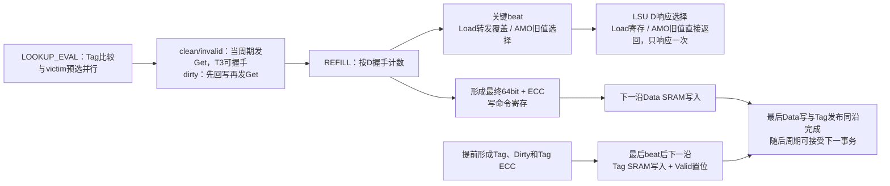

# Refill直接返回与流式安装修订方案

日期：2026-09-22，验证状态更新于2026-09-23。用户已确认：关键beat及此前bus error返回零；关键beat之后的错误只失效原行，不改变已确定结果、不撤回/补发D，包括后续beat报错与LSU D握手同沿。AMO miss直接合并安装、hit保留掩码写。该方案已同步至文档并实现于首版RTL；尚未开展目标工艺综合或STA。

## 1. 目标与数据来源

- miss上下文已经保存请求地址：`critical_beat = req_addr[4:3]`，`lane = req_addr[2]`。按实际BIU D握手计数0、1、2、3即可识别关键beat，无须写入SRAM后重新查找。
- 普通Load关键beat正常到达时，在该接收沿装载LSU D响应寄存器，下一周期输出响应；部分命中的字节使用接受Load时保存的STB转发结果覆盖。
- AMO关键beat先保存：下一周期返回旧目标32bit并寄存AMO运算/ECC写命令，再下一沿写入；另一半来自refill原值。
- 正常路径逐beat安装；最后beat接收后的下一沿完成最后Data写、Tag写和Valid发布。请求不再经过安装后重新lookup，不再调用一轮hit读流水。
- 一个BIU事务仍为32B、四个64bit数据beat，地址和协议不变。不要求BIU把关键beat调到首拍。

本修订区分“LSU收到关键数据”和“DC完成整行事务”。前者可以提前，后者仍须收齐并收尾；不能在尚有数据beat未回时把blocking DCache当作空闲。

## 2. 推荐路径



Tag准备与BIU等待并行。共享Tag快照来自miss lookup，经既定ECC处理后保留其他way，再更新目标way的新Tag和最终Dirty；提前编码并保存。Dirty：Load/LR为0，普通Store/成功SC/AMO为1。CBO_ZERO仍为1，使用零数据源，不发Get。

目标way的旧Valid在脏victim安全收集并回写成功后、开始覆盖Data之前清除；不能为流式安装提前丢掉尚待回写的旧行。REFILL尚未成功收尾时，目标way保持invalid。

## 3. 无错误Load的周期目标

约定`R0..R3`为四个BIU D数据beat实际被接受的上升沿。下表以连续回数、关键beat为1为例；BIU插入空拍时计数与写有效信号随握手推进。

| 边沿 | BIU接收与寄存 | SRAM在该沿采样的操作 | LSU响应 |
| --- | --- | --- | --- |
| R0 | 接收beat0，锁存其已编码Data写命令 | 无本次refill写 | — |
| R1 | 接收关键beat1，锁存其写命令 | 写beat0 | 将关键数据装入D寄存器，R1后有效 |
| R2 | 接收beat2，锁存其写命令 | 写beat1 | LSU在R2接受前一周期响应 |
| R3 | 接收最后beat3，锁存其写命令；按累计及本拍error决定是否装载预备Tag写命令 | 写beat2 | 不重复响应 |
| R3+1 | 最后写提交事件；更新Valid、LFSR并释放旧owner | 同沿写beat3和共享Tag | 如Load关键beat为3，其响应在本沿被LSU接受；本沿不接下一DC请求 |

该目标要求**BIU数据→字节选择/覆盖→ECC编码→Data写命令寄存器**在接收沿之前完成；Data SRAM于下一沿采样已寄存命令。不能先在R3捕获raw、R3+1再寄存编码命令，却仍宣称R3+1完成SRAM写入。此输入路径必须纳入1GHz STA；需要BIU输入时序约束。SRAM读出→ECC解码→立即寄存的既定读路径不变。

Tag编码提前完成，最后beat只决定命令valid和发布资格，避免把Tag修改和编码拖到R3之后。

AMO关键beat=1时增加一拍处理和一个mst D反压周期：

| 物理边沿 | BIU D | SRAM写 | AMO动作 |
| --- | --- | --- | --- |
| C0 | 接收beat0 | — | 寄存beat0写命令 |
| C1 | 接收关键beat1 | 写beat0 | 保存critical_old64 |
| C2 | ready=0 | — | 返回旧值；寄存new64/ECC及beat1写命令 |
| C3 | 接收beat2 | 写AMO后的beat1 | 寄存beat2写命令 |
| C4 | 接收beat3 | 写beat2 | 寄存beat3写命令 |
| C5 | 不接新DC请求 | 写beat3与Tag、置Valid | 释放owner，随后进入IDLE |

关键beat=3时，C4返回旧值并寄存AMO写命令，C5写修改后的beat3和Tag、置Valid。

## 4. 状态与接收边界

正常refill只需一个持续接收/提交的`REFILL`主状态，配合beat计数、写命令valid和最后写标记：

```
REFILL（收数与前一拍写入重叠）
    └─ 最后Data/Tag提交事件 → IDLE
```

普通refill不再经过`INSTALL_PREP → INSTALL_DATA → INSTALL_TAG → PUBLISH → LOOKUP_READ`。`last_write`标记表达尾部一拍的在途写命令，无需为这些动作逐个增加主状态。ZERO可在专用维护流程用零数据源复用同一写流水；不把ZERO状态误用于普通refill。

2026-09-27接口规则收敛：取消独立MISS_SELECT，clean/invalid miss在LOOKUP_EVAL当周期经BIU B_IDLE直通呈现Get，ready=1则T3握手；首D最早在首A握手后的下一拍接收，不允许首A/首D同拍。dirty miss复用有效lookup双字，T3直接读首个缺失victim beat，再连续补齐；无可复用Data时读4拍。全行ECC后寄存及必要修复完成后直接发Put，不设WB_START。回写完成W0后直接转REFILL，最早W1 Get握手；旧Ack与新refill分属不同事务。详细周期见LLD 6.4。

- 第四beat的`bus_done/error`在握手沿产生，供当前主状态使用，不再串接独立`B_DONE`和`FINISH`空转拍。
- 最后写/Tag提交沿占用单端口SRAM，不接下一DC请求。提交后进入IDLE，下一周期请求握手和SRAM读采样同沿发生。
- 下一请求到来时Valid已由前一提交沿更新，不需要valid_next旁路。
- Load提前响应后，可按既定前端规则接收普通Store或Store转发全命中Load；需要DC的新Load仍等当前refill结束。
- AMO即使提前输出旧值，也要保持原子事务互斥，直到修改数据和整行提交/错误收尾完成。提前响应不等于提前解除AMO对后续请求的阻塞。
- 后台Store的pending只在最终提交/错误收尾时清除；不得因目标beat写入就提前报`stb_drained_out`。

## 5. 请求类型处理

| 请求 | 关键beat的结果/写数据 | 响应或完成 |
| --- | --- | --- |
| 普通Load | refill双字按保存的forward_mask覆盖 | 关键beat正常到达后下一周期响应；后续整行安装继续 |
| LR | 保存选中lane的旧值，不修改refill数据 | 首先保留整行成功提交后返回/建锁的约定；不把普通Load的提前返回自动扩展为提前建锁 |
| 普通Store | 对目标beat按pending mask覆盖，编码并随refill写入 | 已提前应答，不另发D；整行提交后清pending，不再重放Store |
| AMO | 保存旧目标32bit；下一周期返回并寄存new64/ECC，随后一沿写入 | 关键beat后对mst D反压一周期；miss按1FF完整安装，原子占用保持至整笔收尾 |
| SC | reservation已通过检查，目标beat按SC mask合并 | 全部成功提交后返回0；错误返回1，无安装后重新读取 |

一次refill用`critical_seen`及`response_issued`记录关键数据和响应是否已发出；寄存响应在装载时、AMO直接响应在发出时置response_issued。它们属于原DC owner，不随前端提前释放而丢失。尾部完成事件不得再响应一次，也不能把旧事务错误送给较新的LSU上下文。原子的响应消费/工作完成记录另保存在前台，计入本沿事件后两者均满足即可同沿接新请求；refill末写沿仍不能接需要读同一SRAM宏的新请求。

## 6. 已确认：AMO miss合并安装

AMO hit仍使用原约定的`wm=9'h10F/9'h1F0`。AMO miss的目标beat直接按下式形成最终安装字：

```
new64 = lane==0 ? {refill_old64[63:32], amo_new32}
                : {amo_new32, refill_old64[31:0]}
install_codeword = ECC(new64)
refill_install_wm = 9'h1FF
```

另一半来自主存refill原值，AMO只改变目标32bit；物理安装给完整64bit和ECC写入确定值。用户已确认这一miss写法，原先10F/1F0的限制仅适用于AMO hit业务写。

不再采用miss先安装原值、然后追加一次10F/1F0写的方案，避免目标beat为最后beat时占用额外Data写周期。

AMO已按最新决定多拆一拍：关键beat握手只保存old64，下一周期执行32bit ALU/ECC并寄存写命令，再下一沿写SRAM。用户已确认按当前LLD保留此时序，不将实际SRAM写提前到返回旧值的同沿。这降低了BIU输入直通ALU/ECC的压力；普通Load和非关键beat时序不变。

## 7. 已确认：以关键beat握手划分响应错误

原“整笔任一beat出错均返回零”的约定已被替换。Load/AMO在关键beat握手时确定响应的错误状态，不等到LSU d_fire再判断：

| 场景 | LSU行为 | Cache行为 |
| --- | --- | --- |
| 关键beat或此前已有error | 关键beat响应为0，不覆盖STB数据 | 累计error、收完四拍；目标invalid，不发布 |
| 关键beat成功，其后beat才error；包括error与LSU d_fire同沿 | 保持关键beat时确定的结果，不改零、不撤回、不补发，不影响较新前台请求 | 同上，清空在途写后释放旧DC owner |

累计判断必须包含当前拍error：`err_next = err_seen | (bus_d_fire && d_error)`。关键beat握手时保存critical_err=err_next；普通Load据此装载零或含转发覆盖的结果，AMO保存该快照供下一沿直接响应使用。后续beat继续更新整笔err_seen，但不更新critical_err、不改变LSU结果；不得将后续beat的error组合覆盖到LSU D。response_issued负责防止重复响应，不能代替关键beat错误快照。

例如R0关键beat正常、准备返回1234；R1下一beat报错且LSU同沿消费D，仍返回1234，只禁止相关行发布。最后beat出错也必须禁止Tag提交和Valid置位。此前已写入目标way的部分数据保持不可见，无需回滚这些无效Data内容。

提前AMO响应后refill失败，可能已返回旧值而修改未发布，这是用户确认的晚到错误语义。SC不提前返回成功，LR不在失败的整行上建锁。

## 8. 同步与验证范围

已同步LLD第3节上下文、第4节响应释放条件、第5节FSM/BIU、第6节miss时序、第7节AMO写掩码、第9节关键路径、第10节验证要求，以及架构/评审/整体图。末拍提交沿不接新DC请求，下一周期恢复；AMO关键beat反压和写命令优先级以LLD 6.3为准。

定向仿真已覆盖四种critical_beat、AMO关键beat后ready低一周期及恢复、普通beat下一沿写、AMO关键beat后第二沿写、各拍注错、后续beat报错与LSU D同沿仍返回原结果、唯一D响应、两lane/全部AMO运算、最后写/Tag/Valid提交、pending与原子占用释放。尚未开展目标工艺综合或STA。
