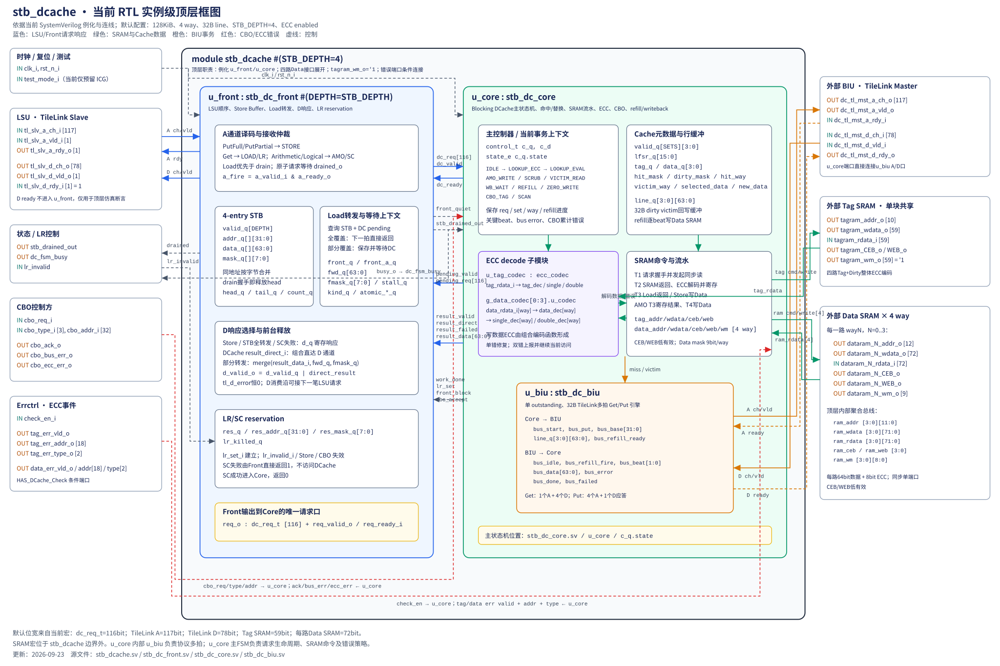

# stb_dcache 当前RTL顶层框图

本图依据当前 `stb_dcache.sv`、`stb_dc_front.sv`、`stb_dc_core.sv` 和 `stb_dc_biu.sv` 的实际例化与端口连接绘制。它描述RTL模块层次；原有 [整体架构图](stb_dcache_block_diagram.md) 继续用于描述功能路径。

[打开可缩放SVG](stb_dcache_rtl_hierarchy.svg) · [打开PNG预览](stb_dcache_rtl_hierarchy_preview.png)



## RTL层次

```text
stb_dcache
├─ u_front : stb_dc_front #(DEPTH=STB_DEPTH)
└─ u_core  : stb_dc_core
   ├─ u_biu : stb_dc_biu
   ├─ u_tag_codec : ecc_codec
   └─ g_data_codec[0:3].u_codec : ecc_codec × 4
```

`stb_dcache` 顶层只直接例化 `u_front` 和 `u_core`。`u_biu`、Tag ECC decoder 和四个Data ECC decoder均属于 `u_core`。主状态机是 `u_core.c_q.state`，声明在 `stb_dc_core.sv`。

## u_front与u_core交互

| 方向 | 顶层内部信号 | 子模块端口 | 含义 |
| --- | --- | --- | --- |
| Front → Core | `dc_req` `[115:0]` | `req_o` → `req_i` | `dc_req_t`：kind、addr、data、mask、opcode、param、size |
| Front → Core | `dc_valid` | `req_valid_o` → `req_valid_i` | Load/原子请求或STB drain有效 |
| Core → Front | `dc_ready` | `req_ready_o` → `req_ready_i` | Core可在本沿接受请求并发起T1 SRAM读 |
| Front → Core | `front_quiet` | `quiescent_o` → `front_quiet_i` | Front没有必须保留的旧响应，或旧D在本沿消费 |
| Front → Core | `stb_drained_out` | `drained_o` → `drained_i` | `STB count==0 && !pending_valid` |
| Core → Front | `pending_valid`、`pending_req` | `pending_valid_o/pending_o` → `pending_valid_i/pending_i` | 已被Core接受但尚未结束的Store；参与Load转发 |
| Core → Front | `result_valid`、`result_direct` | `result_valid_o/result_direct_o` → 对应输入 | DCache读结果；`direct`选择组合直达或Front寄存响应 |
| Core → Front | `result_failed`、`result_data[63:0]` | 对应输出 → 输入 | 失败时Front向LSU返回零；正常时为Load/LR/AMO/SC数据 |
| Core → Front | `work_done` | `work_done_o` → `work_done_i` | 原子操作内部写入、refill或错误收尾已经完成 |
| Core → Front | `lr_set` | `lr_set_o` → `lr_set_i` | LR成功后建立reservation |
| Core → Front | `front_block` | `front_block_o` → `block_i` | CBO或Core控制要求阻止新LSU请求 |
| Core → Front | `cbo_accept` | `cbo_accept_o` → `cbo_accept_i` | CBO正式接收事件，用于Front reservation失效 |

## u_core与u_biu交互

| 方向 | 信号 | 含义 |
| --- | --- | --- |
| Core → BIU | `bus_start`、`bus_put` | 启动32B Get或Put事务 |
| Core → BIU | `bus_base[31:0]` | 32B对齐事务基地址 |
| Core → BIU | `line_q[3:0][63:0]` | dirty victim的四个回写beat |
| Core → BIU | `bus_refill_ready` | Core是否能接受当前refill D beat；AMO关键beat处理时可反压一拍 |
| BIU → Core | `bus_idle` | BIU无活动事务 |
| BIU → Core | `bus_refill_fire`、`bus_beat[1:0]` | Get的某个D beat已经握手及其编号 |
| BIU → Core | `bus_data[63:0]`、`bus_error` | 当前refill数据与本beat错误 |
| BIU → Core | `bus_done`、`bus_failed` | 整笔32B事务完成及累计bus error |

外部 `dc_tl_mst_a_*` 和 `dc_tl_mst_d_*` 由 `u_core` 端口直接连接到 `u_biu` 的A/D端口。Get使用一个A请求和四个D数据beat；Put使用四个A数据beat和一个D应答。

## SRAM与ECC连接

- Tag SRAM是一块共享同步单端口RAM。默认128KiB配置下，地址10bit、码字59bit；四路Tag和Dirty整体编码。`tagram_wm_o`在顶层固定为全1。
- Data SRAM共四路，每路同步单端口。默认地址12bit、数据码字72bit、写mask 9bit。顶层把 `u_core` 的四路数组端口展开为 `dataram_0_*` 至 `dataram_3_*`。
- `u_tag_codec`只对Tag SRAM读码字解码；`g_data_codec[0:3]`分别解码四路Data SRAM读码字。写码字由 `u_core` 的组合编码函数产生。
- `valid_q[set][3:0]`位于 `u_core` 寄存器阵列，不存放在Tag SRAM中；`lfsr_q[15:0]`负责随机替换。

## 顶层端口分组

| 外部接口 | 顶层端口数量 | 连接目标 |
| --- | ---: | --- |
| 时钟、复位、测试 | 3 | `clk_i/rst_n_i`进入Front和Core；`test_mode_i`当前预留 |
| LSU TileLink Slave | 6 | `u_front`；`tl_slv_d_rdy_i`仅用于恒1断言 |
| 状态与LR控制 | 3 | `stb_drained_out`来自Front；`dc_fsm_busy`来自Core；`lr_invalid`进入Front |
| CBO | 6 | Core执行；`cbo_accept`另行通知Front |
| ECC Errctrl | 7 | Core错误检测与事件输出，受 `HAS_DCache_Check` 控制 |
| BIU TileLink Master | 6 | Core内部 `u_biu` |
| Tag SRAM | 6 | Core SRAM控制与Tag ECC decoder |
| Data SRAM × 4 | 24 | Core四路SRAM控制与四个Data ECC decoder |
| **合计** | **61** | 与当前 `stb_dcache.sv` 声明一致 |
